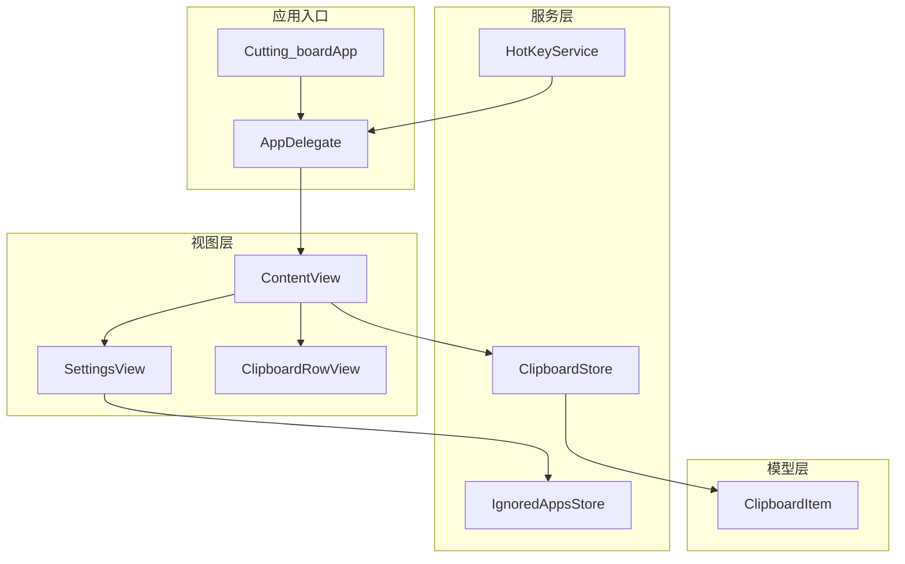
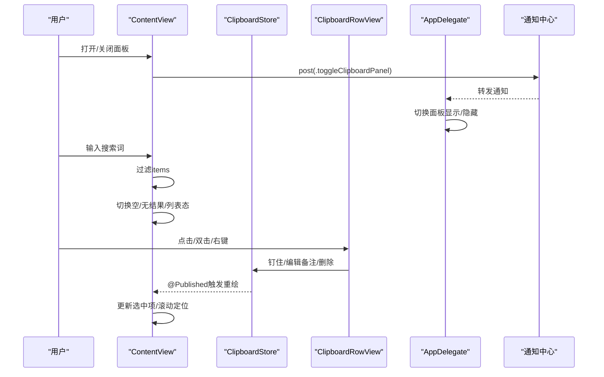
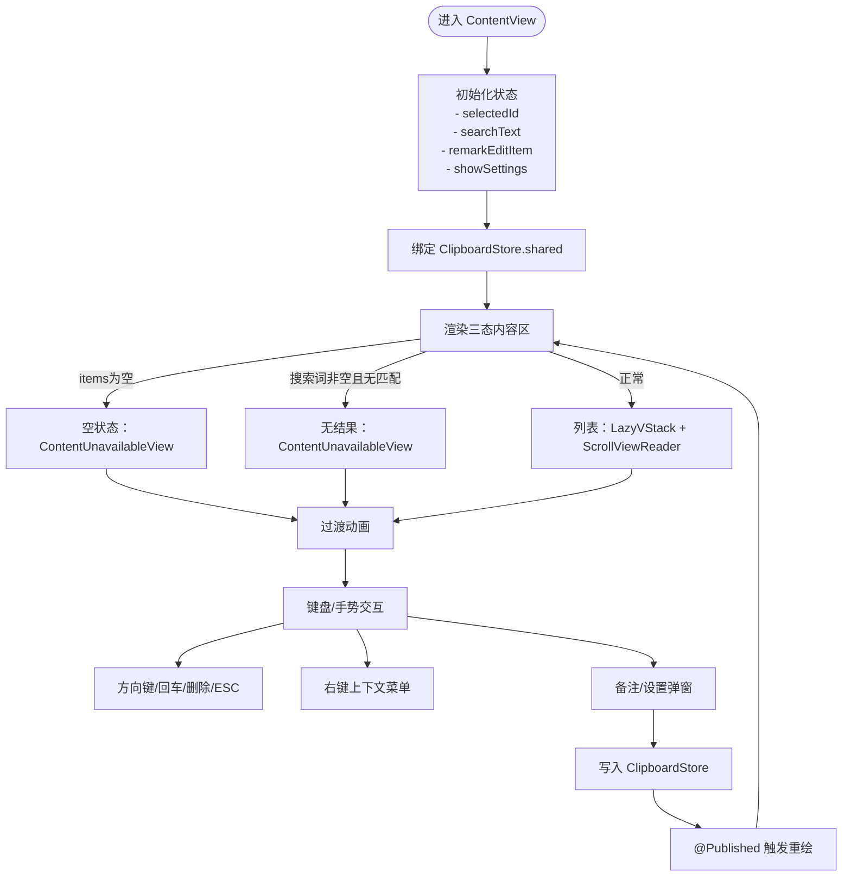
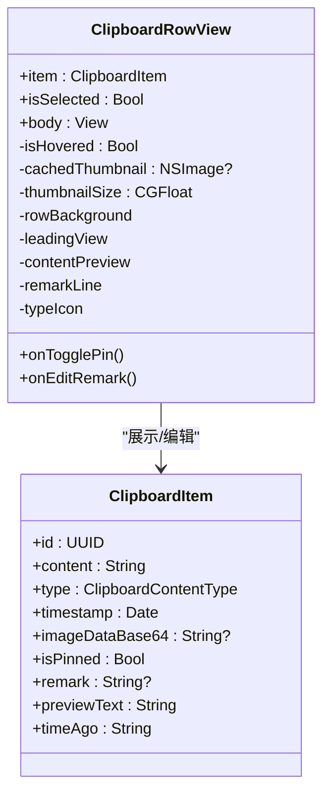
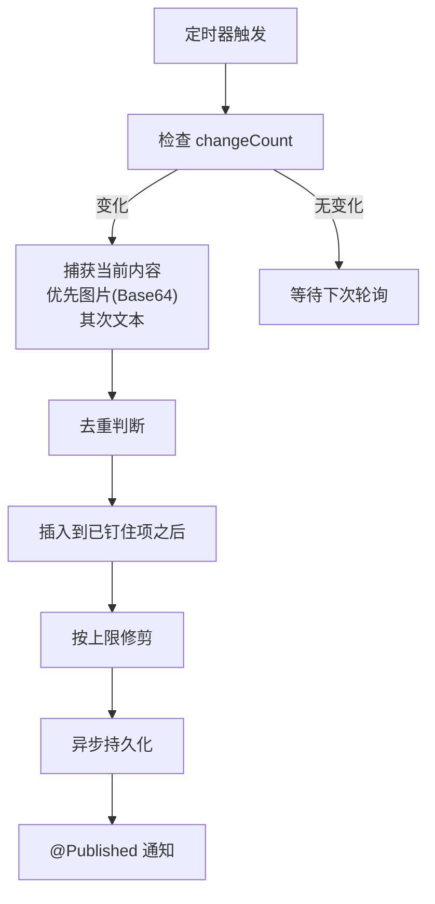
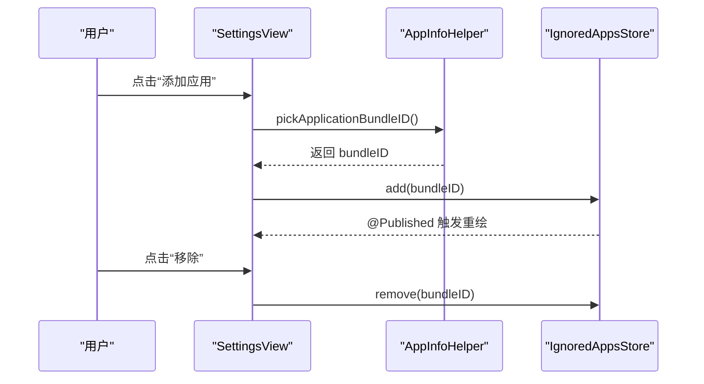
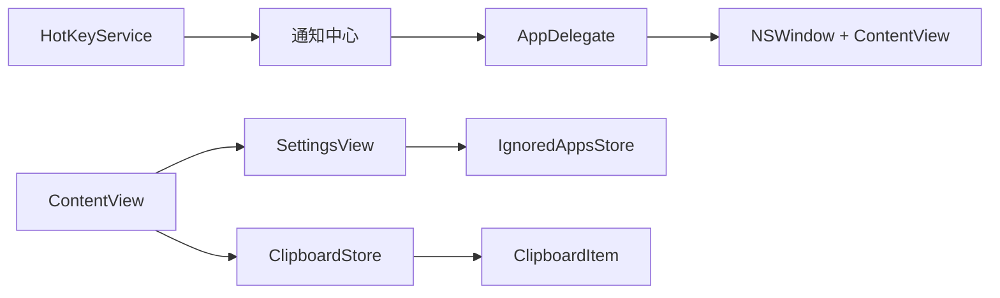

# 主界面设计

<cite>
**本文引用的文件**
- [ContentView.swift](file://Cutting_board/ContentView.swift)
- [Cutting_boardApp.swift](file://Cutting_board/Cutting_boardApp.swift)
- [ClipboardItem.swift](file://Cutting_board/Models/ClipboardItem.swift)
- [ClipboardStore.swift](file://Cutting_board/Services/ClipboardStore.swift)
- [SettingsView.swift](file://Cutting_board/SettingsView.swift)
- [IgnoredAppsStore.swift](file://Cutting_board/Services/IgnoredAppsStore.swift)
- [HotKeyService.swift](file://Cutting_board/Services/HotKeyService.swift)
</cite>

## 目录
1. [简介](#简介)
2. [项目结构](#项目结构)
3. [核心组件](#核心组件)
4. [架构总览](#架构总览)
5. [详细组件分析](#详细组件分析)
6. [依赖关系分析](#依赖关系分析)
7. [性能考量](#性能考量)
8. [故障排查指南](#故障排查指南)
9. [结论](#结论)

## 简介
本文件面向Cutting_board的主界面设计，围绕ContentView展开，系统性阐述其界面架构、响应式布局、组件化设计与SwiftUI最佳实践；详解主历史面板的组成（头部区域、搜索栏、内容列表、空状态）、视觉设计原则（毛玻璃、圆角、阴影、过渡动画）、交互设计（键盘导航、鼠标悬停、选择状态、上下文菜单）以及调试与性能优化建议。目标是帮助开发者与产品/设计人员共同理解并维护该界面的可用性与一致性。

## 项目结构
Cutting_board采用基于功能域的模块化组织：
- 视图层：ContentView、SettingsView
- 模型层：ClipboardItem
- 服务层：ClipboardStore（剪贴板监控与持久化）、IgnoredAppsStore（忽略应用列表）、HotKeyService（全局快捷键）
- 应用入口：Cutting_boardApp（菜单栏入口）

图表来源
- [Cutting_boardApp.swift](file://Cutting_board/Cutting_boardApp.swift#L15-L31)
- [ContentView.swift](file://Cutting_board/ContentView.swift#L20-L95)
- [SettingsView.swift](file://Cutting_board/SettingsView.swift#L11-L39)
- [ClipboardStore.swift](file://Cutting_board/Services/ClipboardStore.swift#L14-L39)
- [IgnoredAppsStore.swift](file://Cutting_board/Services/IgnoredAppsStore.swift#L16-L40)
- [HotKeyService.swift](file://Cutting_board/Services/HotKeyService.swift#L30-L81)

章节来源
- [Cutting_boardApp.swift](file://Cutting_board/Cutting_boardApp.swift#L11-L31)
- [ContentView.swift](file://Cutting_board/ContentView.swift#L20-L95)
- [SettingsView.swift](file://Cutting_board/SettingsView.swift#L11-L39)
- [ClipboardStore.swift](file://Cutting_board/Services/ClipboardStore.swift#L14-L39)
- [IgnoredAppsStore.swift](file://Cutting_board/Services/IgnoredAppsStore.swift#L16-L40)
- [HotKeyService.swift](file://Cutting_board/Services/HotKeyService.swift#L30-L81)

## 核心组件
- ContentView：主面板容器，负责布局、状态管理、键盘/手势交互、空状态与过渡动画。
- ClipboardRowView：单行历史项，包含预览、备注、钉住、悬停与选中态视觉反馈。
- ClipboardStore：剪贴板监控、历史增删改查、持久化与排序。
- SettingsView：设置页，支持忽略应用列表管理。
- IgnoredAppsStore：忽略应用列表的读写与变更通知。
- HotKeyService：全局快捷键注册与回调。
- AppDelegate：菜单栏入口、面板窗口生命周期、通知转发。

章节来源
- [ContentView.swift](file://Cutting_board/ContentView.swift#L20-L305)
- [ClipboardRowView.swift](file://Cutting_board/ContentView.swift#L321-L471)
- [ClipboardStore.swift](file://Cutting_board/Services/ClipboardStore.swift#L14-L222)
- [SettingsView.swift](file://Cutting_board/SettingsView.swift#L11-L89)
- [IgnoredAppsStore.swift](file://Cutting_board/Services/IgnoredAppsStore.swift#L16-L68)
- [HotKeyService.swift](file://Cutting_board/Services/HotKeyService.swift#L30-L81)
- [Cutting_boardApp.swift](file://Cutting_board/Cutting_boardApp.swift#L35-L143)

## 架构总览
ContentView作为主面板的根视图，通过组合多个子视图与服务对象实现完整功能。其核心控制流如下：
- 初始化与状态绑定：订阅ClipboardStore的items变化，维护选中项、搜索词、备注编辑状态与设置弹窗。
- 布局与交互：头部区域、搜索栏、内容区（空/无结果/列表）三态切换，配合键盘事件与上下文菜单。
- 数据与行为：单行项委托操作（钉住、编辑备注、删除），最终通过ClipboardStore执行持久化与排序。
- 视觉与动效：统一的圆角、毛玻璃、阴影与过渡，提升可感知性与一致性。

图表来源
- [ContentView.swift](file://Cutting_board/ContentView.swift#L61-L95)
- [HotKeyService.swift](file://Cutting_board/Services/HotKeyService.swift#L22-L26)
- [Cutting_boardApp.swift](file://Cutting_board/Cutting_boardApp.swift#L100-L142)
- [ClipboardStore.swift](file://Cutting_board/Services/ClipboardStore.swift#L117-L179)

## 详细组件分析

### ContentView：主面板容器
- 响应式布局与尺寸约束：固定最小宽高与最大高度，确保在不同屏幕下保持一致体验。
- 三态内容区：当历史为空显示“暂无历史”空状态；当搜索词非空但无匹配显示“未找到”；否则渲染列表。
- 毛玻璃与边框：外层容器使用毛玻璃与细描边，营造悬浮卡片感。
- 动画与过渡：基于弹簧动画与透明度/缩放组合过渡，减少状态切换的突兀感。
- 键盘导航：方向键上下移动选中项，回车粘贴，Delete删除，Escape关闭面板。
- 交互细节：点击单次选中，双击直接粘贴；右键弹出上下文菜单（编辑备注/删除）。
- 无障碍：为关键元素设置可访问标签与提示，选中态标记为已选中。
- 弹窗与表单：备注编辑使用sheet，设置页使用sheet，均提供键盘快捷键与可访问性提示。

图表来源
- [ContentView.swift](file://Cutting_board/ContentView.swift#L37-L95)
- [ContentView.swift](file://Cutting_board/ContentView.swift#L184-L207)
- [ContentView.swift](file://Cutting_board/ContentView.swift#L276-L296)

章节来源
- [ContentView.swift](file://Cutting_board/ContentView.swift#L20-L95)
- [ContentView.swift](file://Cutting_board/ContentView.swift#L184-L207)
- [ContentView.swift](file://Cutting_board/ContentView.swift#L276-L305)

### ClipboardRowView：单行历史项
- 结构组成：左侧缩略图/类型图标，中间内容预览与备注行及时间描述，右侧操作按钮（备注/钉住）。
- 选中态与悬停态：通过背景毛玻璃与阴影实现视觉区分；悬停态启用毛玻璃交互效果。
- 内容预览：文本类型尝试Markdown解析，图片类型加载缓存缩略图。
- 操作行为：备注按钮根据是否存在备注切换图标与颜色；钉住按钮切换状态并触发排序与持久化。
- 性能优化：使用Equatable避免不必要的重绘；Task异步生成缩略图缓存；clipShape统一圆角。

图表来源
- [ContentView.swift](file://Cutting_board/ContentView.swift#L321-L471)
- [ClipboardItem.swift](file://Cutting_board/Models/ClipboardItem.swift#L17-L89)

章节来源
- [ContentView.swift](file://Cutting_board/ContentView.swift#L321-L471)
- [ClipboardItem.swift](file://Cutting_board/Models/ClipboardItem.swift#L17-L89)

### ClipboardStore：历史存储与监控
- 监控机制：定时器轮询系统剪贴板变更，优先识别图片（PNG Base64），其次识别文本，去重后插入到已钉住项之后。
- 排序策略：钉住项始终在前，未钉住项按时间倒序，超出上限时仅保留钉住项与部分未钉住项。
- 持久化：JSON编码+加密存储于应用支持目录，异步队列写入，保证主线程流畅。
- 操作接口：切换钉住、更新备注、删除、清空、复制到系统剪贴板。

图表来源
- [ClipboardStore.swift](file://Cutting_board/Services/ClipboardStore.swift#L47-L90)
- [ClipboardStore.swift](file://Cutting_board/Services/ClipboardStore.swift#L110-L147)
- [ClipboardStore.swift](file://Cutting_board/Services/ClipboardStore.swift#L210-L221)

章节来源
- [ClipboardStore.swift](file://Cutting_board/Services/ClipboardStore.swift#L14-L222)

### SettingsView：设置页
- 忽略应用列表：展示已配置的应用名称与图标，支持移除与新增（通过系统文件选择器选取.app）。
- 视觉风格：采用毛玻璃卡片与分隔线，保持与主面板一致的设计语言。
- 行为：新增应用后写入IgnoredAppsStore，移除时同步更新。

图表来源
- [SettingsView.swift](file://Cutting_board/SettingsView.swift#L78-L87)
- [IgnoredAppsStore.swift](file://Cutting_board/Services/IgnoredAppsStore.swift#L27-L34)
- [IgnoredAppsStore.swift](file://Cutting_board/Services/IgnoredAppsStore.swift#L57-L67)

章节来源
- [SettingsView.swift](file://Cutting_board/SettingsView.swift#L11-L89)
- [IgnoredAppsStore.swift](file://Cutting_board/Services/IgnoredAppsStore.swift#L16-L68)

### 交互设计与无障碍
- 键盘导航：方向键移动选中项，回车粘贴，Delete删除，ESC关闭面板；支持键盘快捷键（.defaultAction/.escape）。
- 鼠标悬停：悬停态启用毛玻璃交互效果，增强可点击性提示。
- 选择状态：选中项使用毛玻璃背景与阴影强调；无障碍标记为已选中。
- 上下文菜单：右键弹出“编辑备注/删除”，删除后自动调整选中项。
- 无障碍：为所有交互元素提供可访问标签与提示，确保信息完整传达。

章节来源
- [ContentView.swift](file://Cutting_board/ContentView.swift#L69-L87)
- [ContentView.swift](file://Cutting_board/ContentView.swift#L227-L235)
- [ContentView.swift](file://Cutting_board/ContentView.swift#L308-L317)
- [ContentView.swift](file://Cutting_board/ContentView.swift#L379-L382)

### 视觉设计原则
- 毛玻璃效果：统一使用glassEffect修饰，提供交互态与非交互态；在低版本系统上提供材料替代方案。
- 圆角设计：统一圆角半径，配合clipShape与背景形状保持视觉一致性。
- 阴影效果：选中态使用动态阴影，突出层级关系；悬停态使用柔和阴影增强反馈。
- 动画过渡：弹簧动画与透明度/缩放组合，平滑切换三态内容区与选中态变化。
- 颜色与图标：使用SF Symbols图标与语义化前景色，确保可读性与一致性。

章节来源
- [ContentView.swift](file://Cutting_board/ContentView.swift#L56-L60)
- [ContentView.swift](file://Cutting_board/ContentView.swift#L162-L164)
- [ContentView.swift](file://Cutting_board/ContentView.swift#L408-L418)
- [ContentView.swift](file://Cutting_board/ContentView.swift#L308-L317)

## 依赖关系分析
- 组件耦合：ContentView强依赖ClipboardStore；单行视图依赖ClipboardItem；设置页依赖IgnoredAppsStore。
- 通知链路：HotKeyService通过通知中心转发命令至AppDelegate，再由AppDelegate控制面板显示/隐藏。
- 外部依赖：AppKit（NSPasteboard、NSImage、NSWindow）、Foundation（Date、UserDefaults）、Combine（@Published）。

图表来源
- [HotKeyService.swift](file://Cutting_board/Services/HotKeyService.swift#L12-L16)
- [Cutting_boardApp.swift](file://Cutting_board/Cutting_boardApp.swift#L46-L72)
- [Cutting_boardApp.swift](file://Cutting_board/Cutting_boardApp.swift#L78-L98)
- [ContentView.swift](file://Cutting_board/ContentView.swift#L21-L26)
- [SettingsView.swift](file://Cutting_board/SettingsView.swift#L12-L13)
- [ClipboardStore.swift](file://Cutting_board/Services/ClipboardStore.swift#L14-L18)
- [ClipboardItem.swift](file://Cutting_board/Models/ClipboardItem.swift#L17-L27)

章节来源
- [HotKeyService.swift](file://Cutting_board/Services/HotKeyService.swift#L12-L81)
- [Cutting_boardApp.swift](file://Cutting_board/Cutting_boardApp.swift#L35-L143)
- [ContentView.swift](file://Cutting_board/ContentView.swift#L20-L95)
- [SettingsView.swift](file://Cutting_board/SettingsView.swift#L11-L39)
- [ClipboardStore.swift](file://Cutting_board/Services/ClipboardStore.swift#L14-L39)
- [ClipboardItem.swift](file://Cutting_board/Models/ClipboardItem.swift#L17-L27)

## 性能考量
- 列表渲染：使用LazyVStack与ScrollViewReader，结合稳定ID滚动定位，避免全量重建。
- 图片缩略图：仅在需要时生成并缓存，限制缩略图尺寸，降低内存占用。
- 异步持久化：存储与解密在后台队列进行，避免阻塞主线程。
- 动画节流：根据reduceMotion环境变量条件播放动画，兼顾可访问性与性能。
- 去重与修剪：在插入时去重，在超过上限时仅修剪未钉住项，减少IO与排序成本。

章节来源
- [ContentView.swift](file://Cutting_board/ContentView.swift#L184-L207)
- [ContentView.swift](file://Cutting_board/ContentView.swift#L383-L386)
- [ClipboardStore.swift](file://Cutting_board/Services/ClipboardStore.swift#L94-L115)
- [ClipboardStore.swift](file://Cutting_board/Services/ClipboardStore.swift#L210-L221)

## 故障排查指南
- 面板无法显示/隐藏
  - 检查全局快捷键是否注册成功，确认Carbon回调是否触发通知。
  - 确认AppDelegate是否正确创建并持有NSWindow，makeKeyAndOrderFront调用顺序。
- 列表无焦点或键盘无效
  - 确认面板显示后是否将键盘焦点交给内部列表（通过findFirstTableView递归查找NSTableView）。
- 搜索无结果或选中异常
  - 检查onChange of searchText是否正确重置selectedId；过滤逻辑是否包含备注字段。
- 备注编辑/删除无效
  - 确认sheet是否正确绑定item；ClipboardStore对应方法是否调用并触发持久化。
- 图片缩略图不显示
  - 检查Base64数据是否有效；缩略图尺寸计算与绘制流程是否正确。

章节来源
- [HotKeyService.swift](file://Cutting_board/Services/HotKeyService.swift#L36-L69)
- [Cutting_boardApp.swift](file://Cutting_board/Cutting_boardApp.swift#L100-L121)
- [ContentView.swift](file://Cutting_board/ContentView.swift#L64-L68)
- [ContentView.swift](file://Cutting_board/ContentView.swift#L237-L240)
- [ContentView.swift](file://Cutting_board/ContentView.swift#L446-L451)

## 结论
ContentView通过清晰的组件划分、统一的视觉语言与完善的交互体系，构建了简洁高效的剪贴板历史面板。其响应式布局与动画过渡提升了用户体验，而基于服务层的状态管理与持久化策略确保了数据一致性与性能稳定性。遵循本文档的实践建议，可在后续迭代中持续优化可访问性、性能与可维护性。