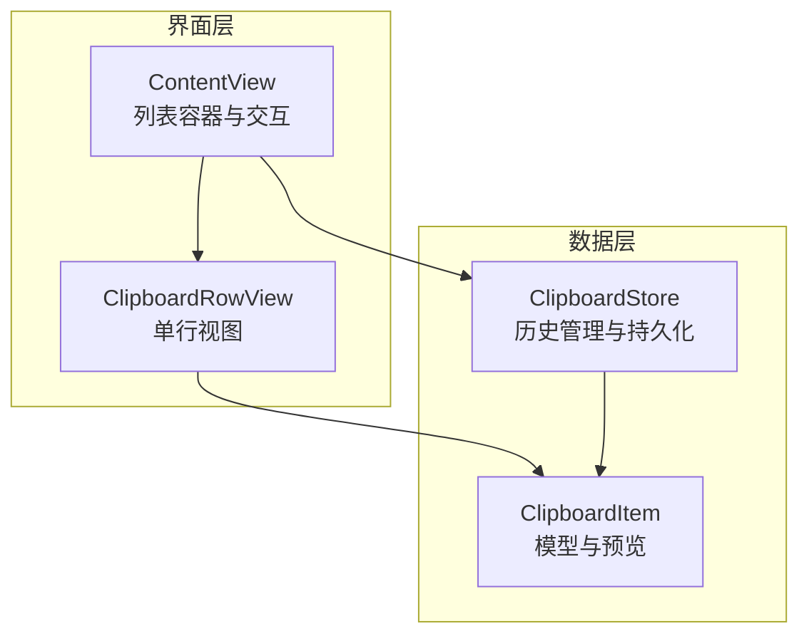
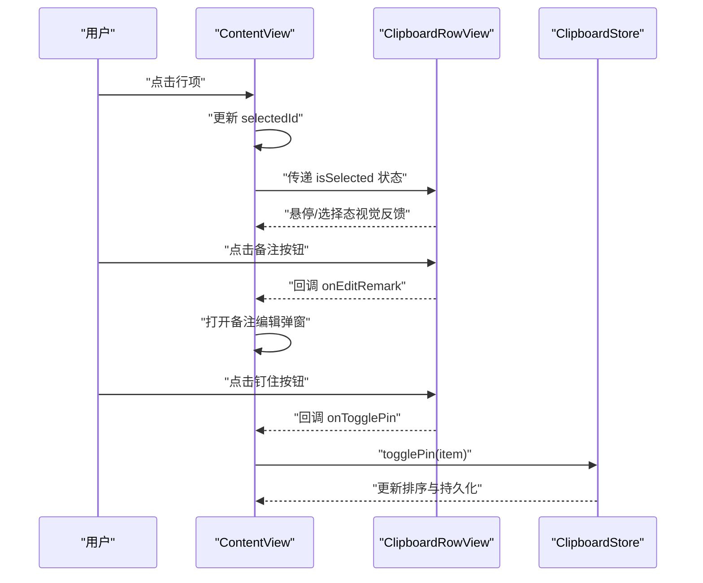
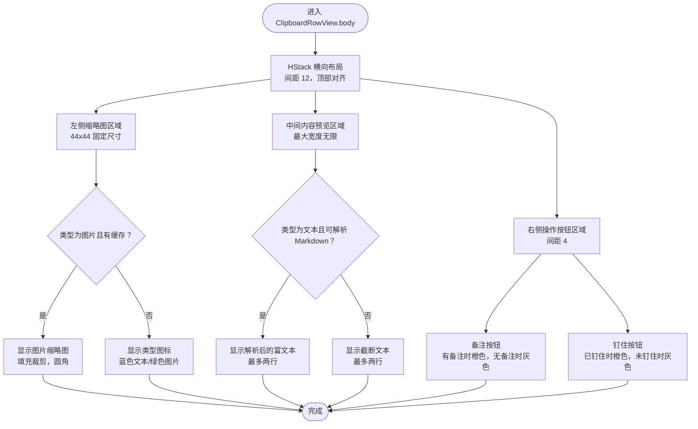
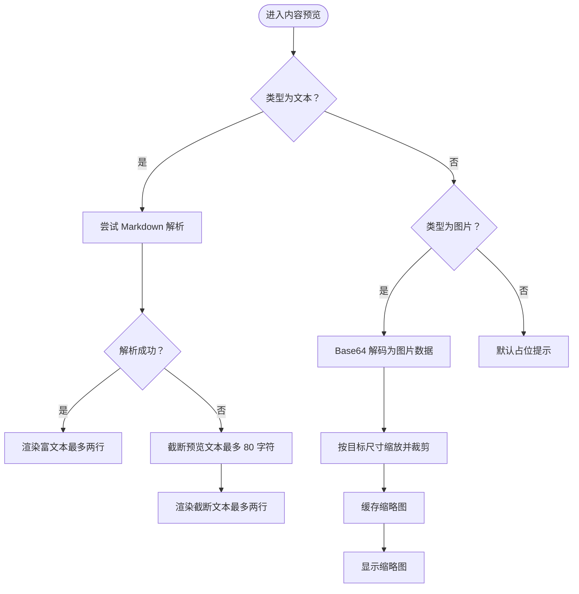
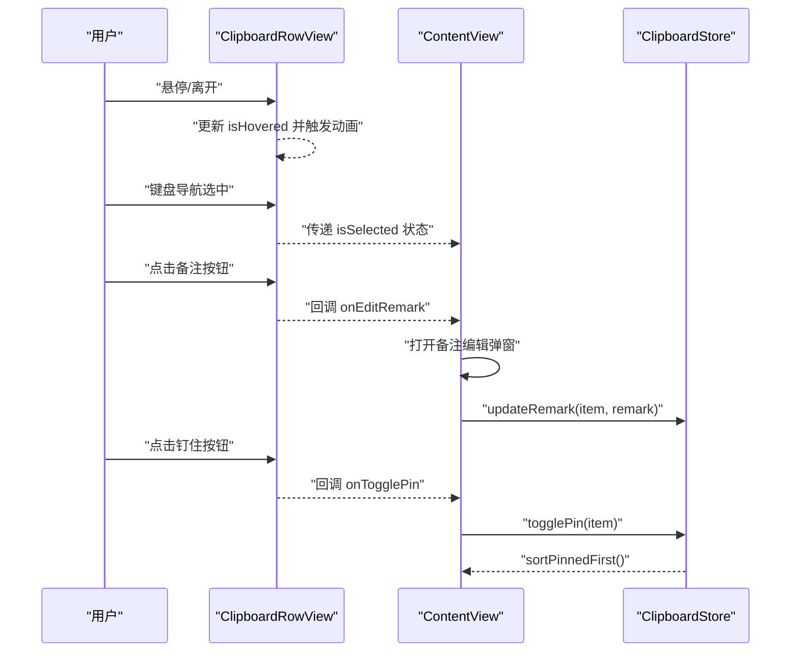
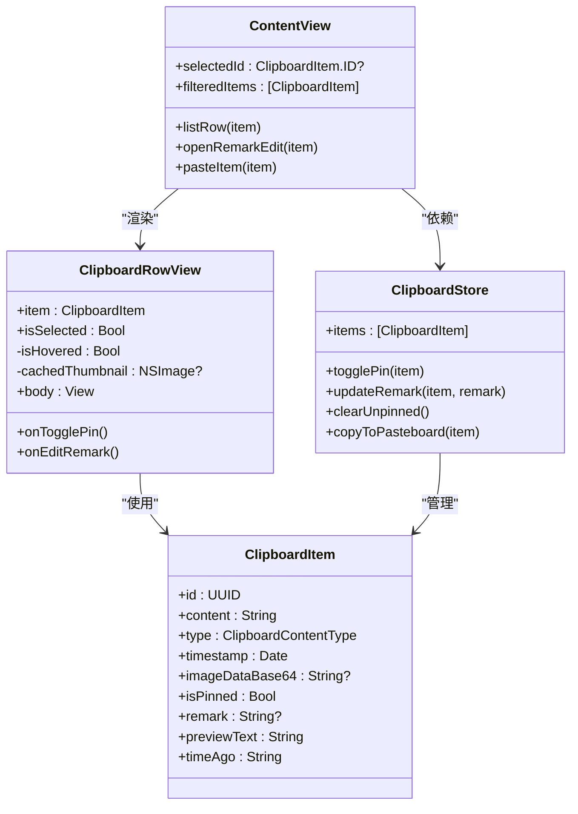

# 剪贴板行视图

<cite>
**本文档引用的文件**
- [ClipboardItem.swift](file://Cutting_board/Models/ClipboardItem.swift)
- [ContentView.swift](file://Cutting_board/ContentView.swift)
- [ClipboardStore.swift](file://Cutting_board/Services/ClipboardStore.swift)
</cite>

## 目录
1. [简介](#简介)
2. [项目结构](#项目结构)
3. [核心组件](#核心组件)
4. [架构总览](#架构总览)
5. [详细组件分析](#详细组件分析)
6. [依赖关系分析](#依赖关系分析)
7. [性能考量](#性能考量)
8. [故障排查指南](#故障排查指南)
9. [结论](#结论)
10. [附录](#附录)

## 简介
本文件聚焦于剪贴板行视图组件 ClipboardRowView 的设计与实现，系统性阐述其布局结构（左侧缩略图区域、中间内容预览区域、右侧操作按钮区域）、文本与图片内容的差异化展示策略、内容预览机制（Markdown 解析、文本截断、图片缩略图生成）、交互行为（悬停效果、选择状态、钉住功能、备注编辑），并提供组件复用与自定义的最佳实践建议。

## 项目结构
- 组件位于主界面视图 ContentView 中，作为列表项使用。
- 数据模型 ClipboardItem 描述剪贴板历史条目的字段与预览逻辑。
- ClipboardStore 负责剪贴板监控、历史管理、持久化与排序（含钉住置顶）。

图表来源
- [ContentView.swift](file://Cutting_board/ContentView.swift#L210-L235)
- [ClipboardItem.swift](file://Cutting_board/Models/ClipboardItem.swift#L17-L89)
- [ClipboardStore.swift](file://Cutting_board/Services/ClipboardStore.swift#L14-L147)

章节来源
- [ContentView.swift](file://Cutting_board/ContentView.swift#L1-L200)
- [ClipboardItem.swift](file://Cutting_board/Models/ClipboardItem.swift#L1-L90)
- [ClipboardStore.swift](file://Cutting_board/Services/ClipboardStore.swift#L1-L200)

## 核心组件
- ClipboardRowView：单条历史记录的渲染视图，负责布局、内容预览、交互与状态反馈。
- ClipboardItem：历史条目模型，包含内容类型、时间戳、是否钉住、备注等，并提供预览文本与相对时间描述。
- ContentView：列表容器，负责键盘导航、双击粘贴、上下文菜单、备注编辑弹窗、行项选择与可访问性标签。
- ClipboardStore：剪贴板监控与历史管理，支持钉住切换、备注更新、清空未钉住、写回系统剪贴板等。

章节来源
- [ClipboardRowView 实现](file://Cutting_board/ContentView.swift#L321-L471)
- [ClipboardItem 模型](file://Cutting_board/Models/ClipboardItem.swift#L17-L89)
- [ContentView 列表与交互](file://Cutting_board/ContentView.swift#L210-L274)
- [ClipboardStore 管理逻辑](file://Cutting_board/Services/ClipboardStore.swift#L14-L147)

## 架构总览
ClipboardRowView 作为列表行，接收来自 ContentView 的数据与回调；其内部根据内容类型选择不同的预览方式，并通过环境变量与修饰符实现悬停与选择态的视觉反馈。ClipboardStore 提供数据源与变更能力，确保钉住置顶与备注更新等操作即时生效。

图表来源
- [ContentView.swift](file://Cutting_board/ContentView.swift#L210-L235)
- [ClipboardRowView 实现](file://Cutting_board/ContentView.swift#L321-L387)
- [ClipboardStore.swift](file://Cutting_board/Services/ClipboardStore.swift#L118-L122)

## 详细组件分析

### ClipboardRowView 布局与结构
- 左侧缩略图区域：优先显示图片缩略图（仅当类型为图片且缓存可用），否则显示类型图标（文本/图片）。
- 中间内容预览区域：文本类型优先尝试 Markdown 解析，失败则显示截断后的纯文本；图片类型显示固定占位提示。
- 右侧操作按钮区域：备注编辑与钉住切换两个按钮，均提供无障碍标签与提示。

图表来源
- [ClipboardRowView 实现](file://Cutting_board/ContentView.swift#L341-L387)
- [内容预览与缩略图](file://Cutting_board/ContentView.swift#L436-L451)
- [类型图标](file://Cutting_board/ContentView.swift#L460-L470)

章节来源
- [ClipboardRowView.body 与子视图](file://Cutting_board/ContentView.swift#L341-L387)
- [缩略图与类型图标](file://Cutting_board/ContentView.swift#L420-L470)

### 内容预览机制
- 文本预览
  - 截断策略：预览文本限制长度，超出部分以省略号收尾，空内容显示占位提示。
  - Markdown 解析：对预览文本尝试解析为富文本，成功则直接渲染；失败则回退为普通文本。
- 图片预览
  - Base64 解码：从模型的 Base64 字段解码为图片数据。
  - 缩略图生成：按目标尺寸进行等比缩放与裁剪，避免在列表中占用过多内存与绘制开销。
  - 缓存策略：首次渲染时异步生成并缓存缩略图，后续复用以提升性能。

图表来源
- [预览文本与 Markdown](file://Cutting_board/Models/ClipboardItem.swift#L74-L88)
- [Markdown 预览与文本截断](file://Cutting_board/ContentView.swift#L436-L458)
- [缩略图生成与缓存](file://Cutting_board/ContentView.swift#L446-L451)

章节来源
- [预览文本与时间描述](file://Cutting_board/Models/ClipboardItem.swift#L74-L88)
- [Markdown 解析与文本截断](file://Cutting_board/ContentView.swift#L436-L458)
- [图片缩略图生成](file://Cutting_board/ContentView.swift#L446-L451)

### 交互行为设计
- 悬停效果：鼠标悬停时显示玻璃质感背景，动画响应平滑弹簧曲线；无障碍“减少动感”模式下禁用动画。
- 选择状态：键盘导航选中时显示阴影与玻璃质感背景，动画随无障碍设置调整。
- 钉住功能：点击钉住按钮触发回调，由 ContentView 调用 ClipboardStore 切换状态并重排，保持钉住项置顶。
- 备注编辑：点击备注按钮打开弹窗，支持多行输入与保存/取消；保存后更新模型并持久化。

图表来源
- [悬停与选择态](file://Cutting_board/ContentView.swift#L334-L382)
- [备注编辑弹窗](file://Cutting_board/ContentView.swift#L242-L274)
- [钉住切换与排序](file://Cutting_board/Services/ClipboardStore.swift#L118-L147)

章节来源
- [悬停与选择态实现](file://Cutting_board/ContentView.swift#L334-L382)
- [备注编辑流程](file://Cutting_board/ContentView.swift#L237-L274)
- [钉住切换与排序](file://Cutting_board/Services/ClipboardStore.swift#L118-L147)

### 组件复用与自定义最佳实践
- 统一行视图：避免在列表中使用 AnyView 包裹不同行视图，保持稳定标识与一致性能。
- 环境注入：通过参数传入回调（如 onTogglePin、onEditRemark）而非在行内直接访问全局状态，增强可测试性与可复用性。
- 缓存与懒加载：图片缩略图采用任务异步生成并缓存，避免主线程阻塞与重复计算。
- 可访问性：为按钮提供清晰的标签与提示，确保键盘导航与屏幕阅读器友好。
- 动画与无障碍：尊重“减少动感”设置，必要时禁用动画以降低资源消耗。

章节来源
- [列表行统一设计参考](file://Cutting_board/ContentView.swift#L184-L199)
- [现代 API 使用建议](file://Cutting_board/ContentView.swift#L11-L18)

## 依赖关系分析
- ClipboardRowView 依赖 ClipboardItem 的字段与预览属性，同时依赖环境变量（无障碍、配色方案）与修饰符（玻璃效果、阴影）。
- ContentView 作为父容器，负责行项选择、键盘导航、上下文菜单、备注编辑弹窗与可访问性标签。
- ClipboardStore 提供数据源与变更能力，包括钉住排序、备注更新、清空未钉住、写回系统剪贴板等。

图表来源
- [ClipboardRowView 定义](file://Cutting_board/ContentView.swift#L321-L332)
- [ClipboardItem 定义](file://Cutting_board/Models/ClipboardItem.swift#L17-L89)
- [ContentView 列表与交互](file://Cutting_board/ContentView.swift#L210-L274)
- [ClipboardStore 管理逻辑](file://Cutting_board/Services/ClipboardStore.swift#L14-L147)

章节来源
- [ClipboardRowView 与 ClipboardItem](file://Cutting_board/ContentView.swift#L321-L332)
- [ClipboardItem 字段与方法](file://Cutting_board/Models/ClipboardItem.swift#L17-L89)
- [ContentView 与 ClipboardStore](file://Cutting_board/ContentView.swift#L210-L274)

## 性能考量
- 图片缩略图：仅在图片类型且缓存缺失时生成，生成后缓存复用，避免重复解码与缩放。
- 异步任务：缩略图生成在任务中执行，避免阻塞主线程。
- 动画控制：根据无障碍设置动态启用/禁用动画，降低不必要的重绘与合成成本。
- 列表优化：统一行视图、稳定标识与惰性渲染，减少重组与重绘。

章节来源
- [缩略图生成与缓存](file://Cutting_board/ContentView.swift#L446-L451)
- [悬停与选择态动画](file://Cutting_board/ContentView.swift#L334-L382)
- [列表行统一设计参考](file://Cutting_board/ContentView.swift#L184-L199)

## 故障排查指南
- 图片不显示
  - 检查模型中 Base64 数据是否有效；确认缩略图生成路径与缓存逻辑。
  - 参考：[缩略图生成](file://Cutting_board/ContentView.swift#L446-L451)
- Markdown 不生效
  - 确认预览文本非空且符合 Markdown 语法；检查解析失败回退逻辑。
  - 参考：[Markdown 预览](file://Cutting_board/ContentView.swift#L454-L458)
- 钉住状态异常
  - 确认回调链路正确调用 ClipboardStore.togglePin，并触发排序与持久化。
  - 参考：[钉住切换](file://Cutting_board/Services/ClipboardStore.swift#L118-L147)
- 备注编辑无效
  - 确认打开弹窗时正确初始化备注文本，保存后调用更新并关闭弹窗。
  - 参考：[备注编辑弹窗](file://Cutting_board/ContentView.swift#L237-L274)

章节来源
- [缩略图生成与缓存](file://Cutting_board/ContentView.swift#L446-L451)
- [Markdown 预览](file://Cutting_board/ContentView.swift#L454-L458)
- [钉住切换与排序](file://Cutting_board/Services/ClipboardStore.swift#L118-L147)
- [备注编辑弹窗](file://Cutting_board/ContentView.swift#L237-L274)

## 结论
ClipboardRowView 通过清晰的三段式布局与差异化的内容预览策略，实现了对文本与图片两类剪贴板内容的高效展示；结合悬停与选择态的视觉反馈、钉住与备注的交互能力，提供了良好的可用性与可访问性。配合 ClipboardStore 的数据管理与持久化，整体形成从监控、存储到呈现的一体化闭环。遵循统一行视图、缓存与无障碍优化等最佳实践，可进一步提升性能与可维护性。

## 附录
- 关键实现位置索引
  - 行视图主体与子视图：[ClipboardRowView.body](file://Cutting_board/ContentView.swift#L341-L387)
  - 内容预览与缩略图：[内容预览](file://Cutting_board/ContentView.swift#L436-L451)
  - 类型图标：[类型图标](file://Cutting_board/ContentView.swift#L460-L470)
  - 列表行封装与交互：[listRow](file://Cutting_board/ContentView.swift#L210-L235)
  - 备注编辑弹窗：[备注编辑弹窗](file://Cutting_board/ContentView.swift#L242-L274)
  - 钉住切换与排序：[togglePin/sortPinnedFirst](file://Cutting_board/Services/ClipboardStore.swift#L118-L147)
  - 预览文本与时间描述：[ClipboardItem 预览](file://Cutting_board/Models/ClipboardItem.swift#L74-L88)