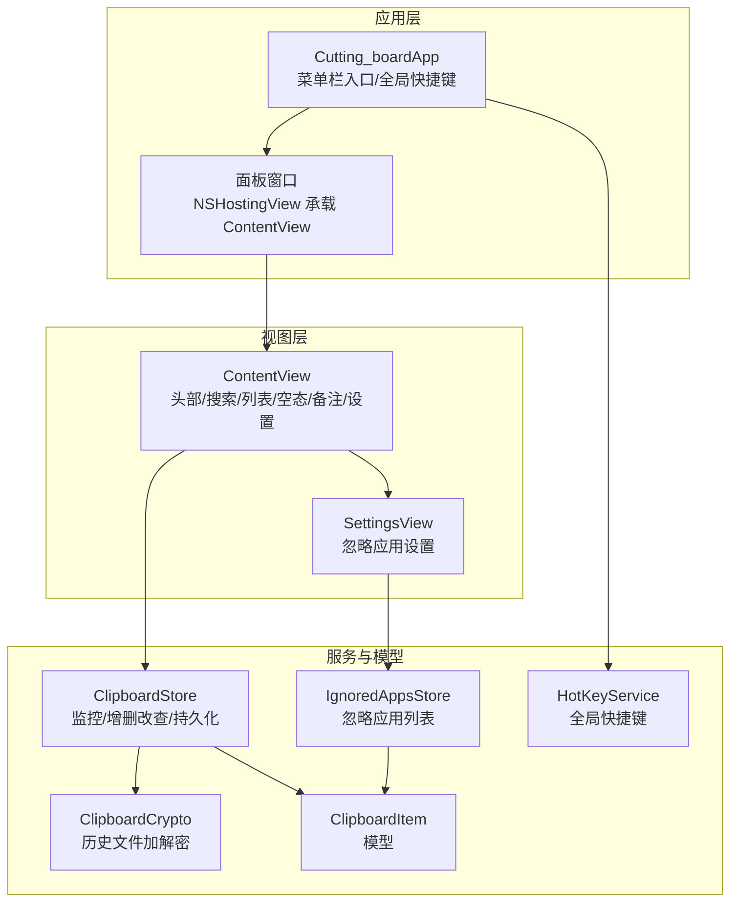
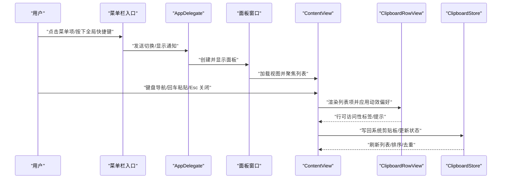
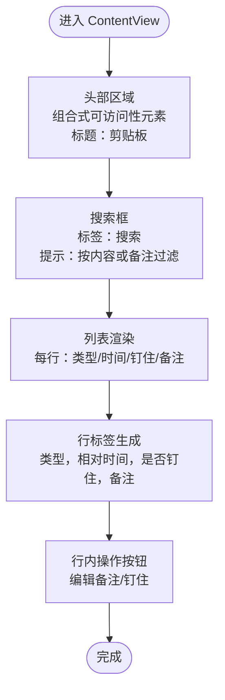
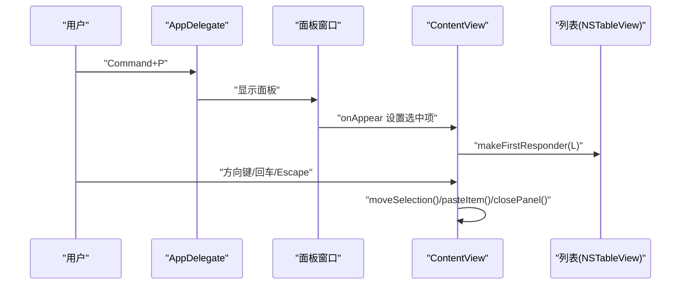
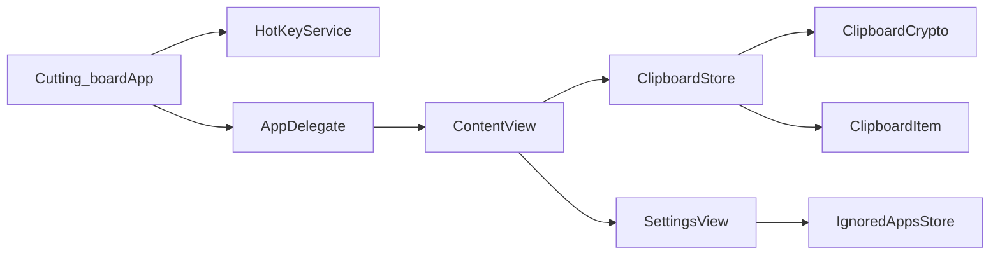

# 无障碍设计

<cite>
**本文引用的文件**
- [Cutting_boardApp.swift](file://Cutting_board/Cutting_boardApp.swift)
- [ContentView.swift](file://Cutting_board/ContentView.swift)
- [SettingsView.swift](file://Cutting_board/SettingsView.swift)
- [ClipboardItem.swift](file://Cutting_board/Models/ClipboardItem.swift)
- [ClipboardStore.swift](file://Cutting_board/Services/ClipboardStore.swift)
- [HotKeyService.swift](file://Cutting_board/Services/HotKeyService.swift)
- [ClipboardCrypto.swift](file://Cutting_board/Services/ClipboardCrypto.swift)
- [IgnoredAppsStore.swift](file://Cutting_board/Services/IgnoredAppsStore.swift)
- [AccentColor.colorset/Contents.json](file://Cutting_board/Assets.xcassets/AccentColor.colorset/Contents.json)
- [Assets.xcassets/Contents.json](file://Cutting_board/Assets.xcassets/Contents.json)
</cite>

## 目录
1. [简介](#简介)
2. [项目结构](#项目结构)
3. [核心组件](#核心组件)
4. [架构总览](#架构总览)
5. [详细组件分析](#详细组件分析)
6. [依赖关系分析](#依赖关系分析)
7. [性能考量](#性能考量)
8. [故障排查指南](#故障排查指南)
9. [结论](#结论)
10. [附录](#附录)

## 简介
本文件面向“Cutting_board”应用的无障碍设计，系统梳理其在屏幕阅读器支持、键盘导航、触控板交互、可访问性标签、颜色对比度与视觉辅助、动效偏好适配、以及测试方法与最佳实践等方面的实现与改进建议。文档以代码为依据，结合架构与数据流进行可视化说明，并提供可操作的测试步骤与合规建议。

## 项目结构
Cutting_board 采用 SwiftUI + AppKit 架构，主应用通过菜单栏入口提供快捷唤起能力，核心界面为一个无边框的浮动面板，内含剪贴板历史列表、搜索、备注编辑与设置等功能。关键模块包括：
- 应用入口与场景管理：菜单栏入口、全局快捷键、面板窗口生命周期
- 视图层：头部、搜索、列表、空态、备注编辑弹窗、设置页
- 数据与服务：剪贴板监控、历史存储、加密、忽略应用列表
- 资源与样式：玻璃材质、圆角、动效与颜色

图表来源
- [Cutting_boardApp.swift](file://Cutting_board/Cutting_boardApp.swift#L11-L31)
- [ContentView.swift](file://Cutting_board/ContentView.swift#L20-L95)
- [SettingsView.swift](file://Cutting_board/SettingsView.swift#L11-L39)
- [ClipboardStore.swift](file://Cutting_board/Services/ClipboardStore.swift#L14-L39)
- [HotKeyService.swift](file://Cutting_board/Services/HotKeyService.swift#L30-L69)
- [IgnoredAppsStore.swift](file://Cutting_board/Services/IgnoredAppsStore.swift#L16-L25)
- [ClipboardItem.swift](file://Cutting_board/Models/ClipboardItem.swift#L17-L45)

章节来源
- [Cutting_boardApp.swift](file://Cutting_board/Cutting_boardApp.swift#L11-L31)
- [ContentView.swift](file://Cutting_board/ContentView.swift#L20-L95)
- [SettingsView.swift](file://Cutting_board/SettingsView.swift#L11-L39)

## 核心组件
- 应用入口与场景
  - 菜单栏入口提供“打开/关闭剪贴板”与“退出”，并绑定快捷键
  - AppDelegate 负责创建面板窗口、注册全局快捷键、响应通知切换面板
- 视图层
  - ContentView 提供头部标题、搜索、列表、空态与无结果态；支持键盘方向键、回车、Esc 等
  - ClipboardRowView 行内包含类型图标、预览、备注、时间、钉住与备注按钮
  - SettingsView 提供忽略应用列表与添加应用
- 服务与模型
  - ClipboardStore 负责监控系统剪贴板变化、去重、排序、持久化与写回
  - HotKeyService 使用 Carbon API 注册全局快捷键，无需辅助功能权限
  - IgnoredAppsStore 维护忽略的应用 Bundle ID 列表
  - ClipboardCrypto 对历史文件进行加密存储

章节来源
- [Cutting_boardApp.swift](file://Cutting_board/Cutting_boardApp.swift#L35-L143)
- [ContentView.swift](file://Cutting_board/ContentView.swift#L20-L305)
- [SettingsView.swift](file://Cutting_board/SettingsView.swift#L11-L89)
- [ClipboardStore.swift](file://Cutting_board/Services/ClipboardStore.swift#L14-L223)
- [HotKeyService.swift](file://Cutting_board/Services/HotKeyService.swift#L30-L81)
- [IgnoredAppsStore.swift](file://Cutting_board/Services/IgnoredAppsStore.swift#L16-L40)
- [ClipboardItem.swift](file://Cutting_board/Models/ClipboardItem.swift#L17-L89)

## 架构总览
下图展示从用户交互到数据更新的端到端流程，包括键盘导航、全局快捷键、列表渲染与动效偏好控制。

图表来源
- [Cutting_boardApp.swift](file://Cutting_board/Cutting_boardApp.swift#L100-L142)
- [ContentView.swift](file://Cutting_board/ContentView.swift#L69-L95)
- [ClipboardStore.swift](file://Cutting_board/Services/ClipboardStore.swift#L167-L179)

## 详细组件分析

### 屏幕阅读器支持
- 语义化标签与描述
  - 头部区域使用组合式可访问性元素，明确标题“剪贴板”
  - 搜索框提供“搜索”标签与“按内容或备注过滤列表”的提示
  - 清空按钮提供“清空”标签与“清空未钉住的历史，已置顶项保留”的提示
  - 列表行提供完整可读的行标签，包含类型、相对时间、是否钉住、备注等
  - 备注编辑弹窗提供“编辑备注”标题与“备注”字段标签与提示
- 隐藏装饰性元素
  - 类型图标与搜索图标标记为隐藏，避免重复播报
- 可访问性特性
  - 使用“isHeader”标记弹窗标题
  - 使用“isSelected”特性标注当前选中项
  - 使用“accessibilityLabel”“accessibilityHint”“accessibilityHidden”“accessibilityAddTraits”

图表来源
- [ContentView.swift](file://Cutting_board/ContentView.swift#L97-L136)
- [ContentView.swift](file://Cutting_board/ContentView.swift#L138-L165)
- [ContentView.swift](file://Cutting_board/ContentView.swift#L184-L235)
- [ContentView.swift](file://Cutting_board/ContentView.swift#L298-L304)

章节来源
- [ContentView.swift](file://Cutting_board/ContentView.swift#L97-L136)
- [ContentView.swift](file://Cutting_board/ContentView.swift#L138-L165)
- [ContentView.swift](file://Cutting_board/ContentView.swift#L184-L235)
- [ContentView.swift](file://Cutting_board/ContentView.swift#L242-L274)
- [ContentView.swift](file://Cutting_board/ContentView.swift#L298-L304)

### 键盘导航与交互
- 键盘快捷键
  - 菜单栏入口绑定“Command+P”打开/关闭面板
  - 面板内支持方向键上下移动选中项、回车粘贴、Esc 关闭
  - 备注编辑弹窗支持 Esc 取消、默认动作保存
- 焦点管理
  - 显示面板时主动将首焦点设置到列表（NSTableView）
  - 列表滚动时基于稳定 ID 平滑滚动，避免动画干扰
- 触控板手势
  - 列表使用隐藏滚动指示器的滚动视图，适合触控板自然滚动
  - 行内按钮使用按钮样式，具备键盘可达性与可聚焦性

图表来源
- [Cutting_boardApp.swift](file://Cutting_board/Cutting_boardApp.swift#L17-L27)
- [Cutting_boardApp.swift](file://Cutting_board/Cutting_boardApp.swift#L100-L121)
- [ContentView.swift](file://Cutting_board/ContentView.swift#L69-L87)
- [ContentView.swift](file://Cutting_board/ContentView.swift#L184-L207)

章节来源
- [Cutting_boardApp.swift](file://Cutting_board/Cutting_boardApp.swift#L17-L27)
- [Cutting_boardApp.swift](file://Cutting_board/Cutting_boardApp.swift#L100-L121)
- [ContentView.swift](file://Cutting_board/ContentView.swift#L69-L87)
- [ContentView.swift](file://Cutting_board/ContentView.swift#L184-L207)

### 触控板手势与动效偏好
- 动效偏好
  - 通过环境变量读取“减少动态效果”偏好，条件性地禁用动画
  - 列表切换与行高亮等过渡均受此偏好控制
- 触控板滚动
  - 列表使用隐藏滚动指示器的滚动视图，提升触控板自然滚动体验
- 视觉反馈
  - 行内悬停与选中使用玻璃材质与阴影，增强可感知性

章节来源
- [ContentView.swift](file://Cutting_board/ContentView.swift#L27-L53)
- [ContentView.swift](file://Cutting_board/ContentView.swift#L336-L382)
- [ContentView.swift](file://Cutting_board/ContentView.swift#L195-L207)

### 可访问性标签与描述性文本
- 标签策略
  - 所有交互元素均提供清晰的标签与提示
  - 列表行标签整合类型、时间、钉住状态与备注，形成完整语义
- 隐藏装饰性内容
  - 图标使用“隐藏”标记，避免冗余播报
- 结构化组织
  - 头部区域使用“组合式子元素”组织，确保阅读器正确理解层次

章节来源
- [ContentView.swift](file://Cutting_board/ContentView.swift#L102-L102)
- [ContentView.swift](file://Cutting_board/ContentView.swift#L143-L143)
- [ContentView.swift](file://Cutting_board/ContentView.swift#L134-L135)
- [ContentView.swift](file://Cutting_board/ContentView.swift#L224-L226)
- [ContentView.swift](file://Cutting_board/ContentView.swift#L360-L371)

### 颜色对比度与视觉辅助
- 当前实现
  - 使用系统玻璃材质与圆角背景，强调内容层次
  - 行内图标与状态使用语义化前景色（蓝色/绿色/橙色/灰色）
- 改进建议
  - 引入高对比度模式下的替代配色方案
  - 为关键状态（如“无历史”“无结果”）提供更强对比的视觉提示
  - 为动效偏好用户提供更明确的反馈（如禁用动画时的替代过渡）

章节来源
- [ContentView.swift](file://Cutting_board/ContentView.swift#L56-L60)
- [ContentView.swift](file://Cutting_board/ContentView.swift#L408-L418)
- [ContentView.swift](file://Cutting_board/ContentView.swift#L460-L470)

### 全局快捷键与无障碍权限
- 全局快捷键
  - 使用 Carbon API 注册 Command+P，无需辅助功能权限即可触发
  - 通过通知中心分发显示/隐藏/切换面板事件
- 无障碍权限
  - 本功能无需辅助功能权限，降低用户授权门槛

章节来源
- [HotKeyService.swift](file://Cutting_board/Services/HotKeyService.swift#L30-L81)
- [Cutting_boardApp.swift](file://Cutting_board/Cutting_boardApp.swift#L46-L66)

### 数据模型与可访问性
- ClipboardItem
  - 提供预览文本与相对时间描述，便于屏幕阅读器朗读
  - 备注字段参与行标签拼接，提升上下文完整性

章节来源
- [ClipboardItem.swift](file://Cutting_board/Models/ClipboardItem.swift#L74-L89)

### 设置与忽略应用
- 忽略应用列表
  - 支持添加/移除应用，显示应用名称与图标
  - 使用按钮样式与键盘可达性，保证键盘导航一致性

章节来源
- [SettingsView.swift](file://Cutting_board/SettingsView.swift#L41-L88)
- [IgnoredAppsStore.swift](file://Cutting_board/Services/IgnoredAppsStore.swift#L16-L40)

## 依赖关系分析
- 组件耦合
  - ContentView 依赖 ClipboardStore 进行数据读写与排序
  - AppDelegate 依赖 HotKeyService 与通知中心协调面板显示
  - SettingsView 依赖 IgnoredAppsStore 与 AppInfoHelper 获取应用信息
- 外部依赖
  - Carbon API 用于全局快捷键
  - Keychain 与 AES-GCM 用于历史文件加密

图表来源
- [ContentView.swift](file://Cutting_board/ContentView.swift#L21-L22)
- [Cutting_boardApp.swift](file://Cutting_board/Cutting_boardApp.swift#L35-L44)
- [SettingsView.swift](file://Cutting_board/SettingsView.swift#L12-L13)
- [HotKeyService.swift](file://Cutting_board/Services/HotKeyService.swift#L30-L34)
- [ClipboardStore.swift](file://Cutting_board/Services/ClipboardStore.swift#L14-L29)
- [ClipboardCrypto.swift](file://Cutting_board/Services/ClipboardCrypto.swift#L16-L29)
- [ClipboardItem.swift](file://Cutting_board/Models/ClipboardItem.swift#L17-L28)

章节来源
- [ContentView.swift](file://Cutting_board/ContentView.swift#L21-L22)
- [Cutting_boardApp.swift](file://Cutting_board/Cutting_boardApp.swift#L35-L44)
- [SettingsView.swift](file://Cutting_board/SettingsView.swift#L12-L13)
- [HotKeyService.swift](file://Cutting_board/Services/HotKeyService.swift#L30-L34)
- [ClipboardStore.swift](file://Cutting_board/Services/ClipboardStore.swift#L14-L29)
- [ClipboardCrypto.swift](file://Cutting_board/Services/ClipboardCrypto.swift#L16-L29)
- [ClipboardItem.swift](file://Cutting_board/Models/ClipboardItem.swift#L17-L28)

## 性能考量
- 动效与可访问性
  - 通过“减少动态效果”偏好禁用动画，避免对注意力缺陷用户的干扰
  - 列表滚动与过渡使用弹簧动画，兼顾流畅与可感知性
- 焦点与渲染
  - 面板显示时延迟短时间后设置焦点，避免渲染竞争
  - 行内任务仅在需要时生成缩略图，降低 CPU/GPU 压力

章节来源
- [ContentView.swift](file://Cutting_board/ContentView.swift#L27-L53)
- [Cutting_boardApp.swift](file://Cutting_board/Cutting_boardApp.swift#L106-L111)
- [ContentView.swift](file://Cutting_board/ContentView.swift#L383-L386)

## 故障排查指南
- VoiceOver 测试
  - 验证头部、搜索、列表、空态、备注编辑弹窗与设置页的标签与提示是否完整
  - 检查行标签是否包含类型、相对时间、钉住状态与备注
- 键盘导航验证
  - 使用 Tab/Shift+Tab 导航至各按钮与列表项
  - 方向键应正确移动选中项，回车执行粘贴，Esc 关闭面板
- 全局快捷键
  - 确认 Command+P 能在任意应用中唤起/隐藏面板
  - 如快捷键无效，检查系统“辅助功能”中“指针与键盘”设置
- 忽略应用设置
  - 添加/移除应用后，确认历史中不再出现对应应用复制的内容

章节来源
- [Cutting_boardApp.swift](file://Cutting_board/Cutting_boardApp.swift#L17-L27)
- [Cutting_boardApp.swift](file://Cutting_board/Cutting_boardApp.swift#L100-L121)
- [HotKeyService.swift](file://Cutting_board/Services/HotKeyService.swift#L36-L69)
- [SettingsView.swift](file://Cutting_board/SettingsView.swift#L78-L87)

## 结论
Cutting_board 在无障碍方面已具备良好的基础：清晰的可访问性标签、完整的键盘导航、全局快捷键与合理的动效偏好处理。为进一步提升可用性，建议补充高对比度模式支持、强化“无历史/无结果”状态的视觉提示，并完善对注意力缺陷用户的动效适配。通过持续的 VoiceOver 与键盘导航测试，可确保产品在不同用户群体中的稳定性与一致性。

## 附录

### 无障碍测试清单
- 屏幕阅读器
  - 验证所有交互元素的标签与提示
  - 验证列表行标签的完整性与顺序
- 键盘导航
  - 验证方向键、回车、Esc 的行为
  - 验证面板显示后的焦点位置
- 触控板与鼠标
  - 验证滚动与悬停反馈
- 动效偏好
  - 在“减少动态效果”下验证动画禁用
- 全局快捷键
  - 在任意应用中验证 Command+P 的响应

### 合规性与最佳实践
- 标签与提示
  - 为每个交互元素提供明确的标签与提示
  - 避免仅依赖图标传达语义
- 键盘可达性
  - 优先使用 Button，而非 onGesture
  - 保持键盘焦点路径一致
- 动效与性能
  - 尊重系统“减少动态效果”偏好
  - 控制动画范围与频率，避免眩晕感
- 颜色与对比度
  - 提供高对比度替代方案
  - 避免仅靠颜色区分状态