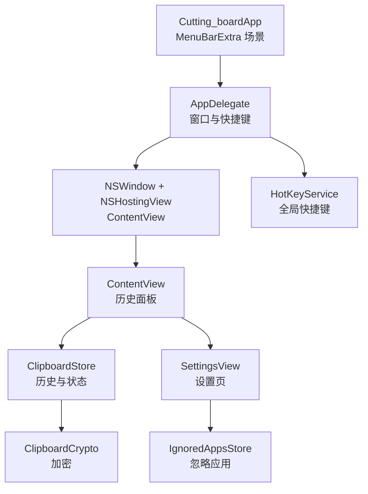
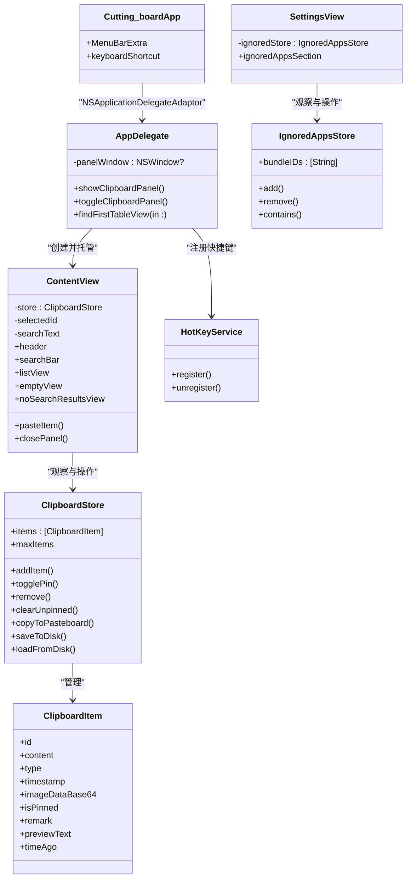
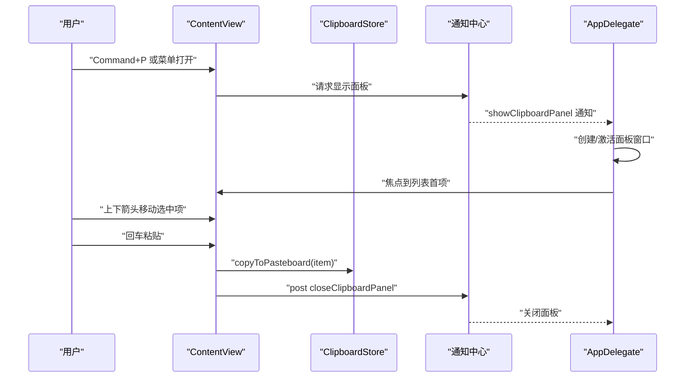
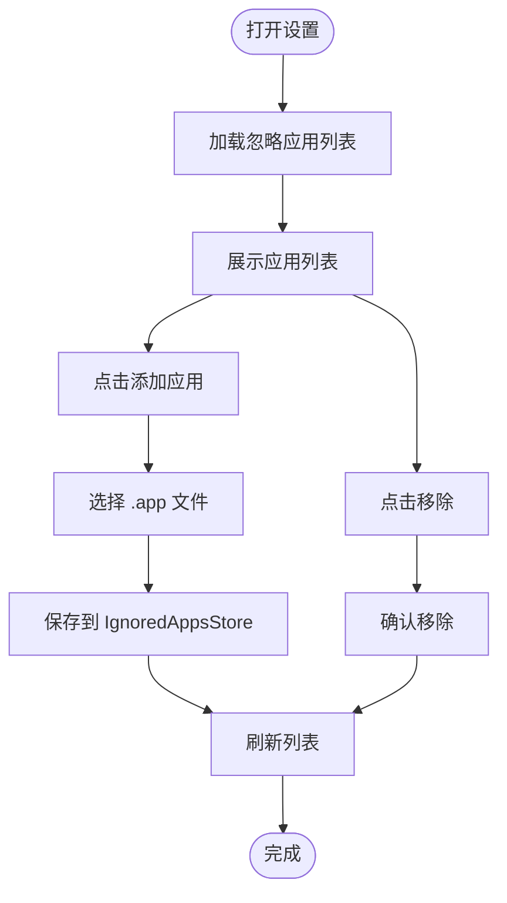
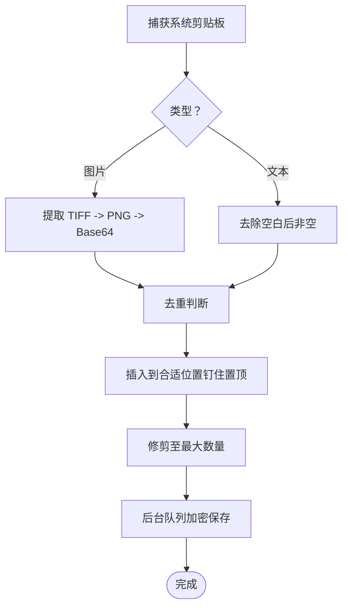
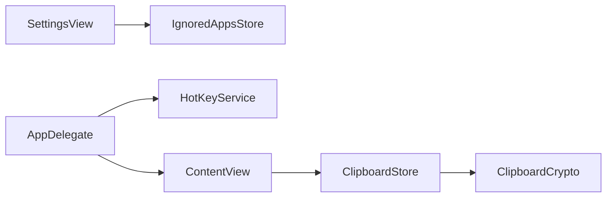

# 用户界面设计

<cite>
**本文引用的文件**
- [ContentView.swift](file://Cutting_board/ContentView.swift)
- [SettingsView.swift](file://Cutting_board/SettingsView.swift)
- [Cutting_boardApp.swift](file://Cutting_board/Cutting_boardApp.swift)
- [ClipboardItem.swift](file://Cutting_board/Models/ClipboardItem.swift)
- [ClipboardStore.swift](file://Cutting_board/Services/ClipboardStore.swift)
- [IgnoredAppsStore.swift](file://Cutting_board/Services/IgnoredAppsStore.swift)
- [HotKeyService.swift](file://Cutting_board/Services/HotKeyService.swift)
- [ClipboardCrypto.swift](file://Cutting_board/Services/ClipboardCrypto.swift)
- [layout-best-practices.md](file://.agents/skills/swiftui-expert-skill/references/layout-best-practices.md)
- [state-management.md](file://.agents/skills/swiftui-expert-skill/references/state-management.md)
- [list-patterns.md](file://.agents/skills/swiftui-expert-skill/references/list-patterns.md)
</cite>

## 目录
1. [简介](#简介)
2. [项目结构](#项目结构)
3. [核心组件](#核心组件)
4. [架构总览](#架构总览)
5. [详细组件分析](#详细组件分析)
6. [依赖关系分析](#依赖关系分析)
7. [性能考量](#性能考量)
8. [故障排查指南](#故障排查指南)
9. [结论](#结论)
10. [附录](#附录)

## 简介
本文件面向Cutting_board的用户界面设计，系统性阐述基于SwiftUI的界面架构与设计原则，覆盖响应式布局、组件化设计、主历史面板的列表展示与交互、设置界面设计理念与实现、macOS设计规范的应用（菜单栏集成、窗口管理、键盘快捷键）、界面自定义与主题支持、无障碍功能实现，以及界面调试与性能优化的最佳实践。文档同时结合仓库内的设计参考材料，确保设计与实现遵循SwiftUI最佳实践。

## 项目结构
Cutting_board采用模块化的SwiftUI架构：
- 应用入口与菜单栏集成：MenuBarExtra场景，AppDelegate负责窗口生命周期与全局快捷键注册
- 主界面：ContentView作为剪贴板历史面板，包含头部、搜索、列表、空态与无结果态
- 设置界面：SettingsView用于忽略应用列表管理
- 数据层：ClipboardStore负责剪贴板监控、历史持久化与状态变更；IgnoredAppsStore管理忽略应用列表
- 工具与安全：HotKeyService提供全局快捷键；ClipboardCrypto提供历史文件加密

图表来源
- [Cutting_boardApp.swift](file://Cutting_board/Cutting_boardApp.swift#L15-L31)
- [Cutting_boardApp.swift](file://Cutting_board/Cutting_boardApp.swift#L35-L143)
- [ContentView.swift](file://Cutting_board/ContentView.swift#L20-L95)
- [SettingsView.swift](file://Cutting_board/SettingsView.swift#L11-L39)
- [ClipboardStore.swift](file://Cutting_board/Services/ClipboardStore.swift#L14-L39)
- [IgnoredAppsStore.swift](file://Cutting_board/Services/IgnoredAppsStore.swift#L16-L40)
- [HotKeyService.swift](file://Cutting_board/Services/HotKeyService.swift#L30-L81)
- [ClipboardCrypto.swift](file://Cutting_board/Services/ClipboardCrypto.swift#L16-L46)

章节来源
- [Cutting_boardApp.swift](file://Cutting_board/Cutting_boardApp.swift#L11-L143)
- [ContentView.swift](file://Cutting_board/ContentView.swift#L20-L95)
- [SettingsView.swift](file://Cutting_board/SettingsView.swift#L11-L39)

## 核心组件
- 主历史面板（ContentView）
  - 响应式布局：固定最小尺寸与最大高度，使用玻璃效果容器与圆角边框
  - 列表展示：LazyVStack + 过滤后的剪贴板项，支持键盘导航与双击粘贴
  - 交互操作：选中高亮、悬停高亮、上下键移动、回车粘贴、Esc关闭、删除键移除
  - 视觉反馈：Spring动画、透明度与缩放过渡、键盘选中阴影
  - 无障碍：可访问性标签、提示、Trait标记、隐藏不可见元素
- 设置界面（SettingsView）
  - 忽略应用列表：动态展示应用图标与名称，支持添加与移除
  - 界面风格：玻璃容器、统一圆角、键盘快捷键“完成”
- 数据模型（ClipboardItem）
  - 内容类型（文本/图片）、时间戳、是否钉住、备注、预览文本与相对时间
- 存储与业务（ClipboardStore）
  - 监控系统剪贴板变化、去重、插入策略（钉住项置顶）、修剪策略、持久化与加密
- 快捷键与窗口（HotKeyService、AppDelegate）
  - 全局Command+P切换面板；AppDelegate创建面板窗口、焦点管理、通知驱动显示/隐藏

章节来源
- [ContentView.swift](file://Cutting_board/ContentView.swift#L20-L95)
- [SettingsView.swift](file://Cutting_board/SettingsView.swift#L11-L88)
- [ClipboardItem.swift](file://Cutting_board/Models/ClipboardItem.swift#L17-L89)
- [ClipboardStore.swift](file://Cutting_board/Services/ClipboardStore.swift#L14-L222)
- [HotKeyService.swift](file://Cutting_board/Services/HotKeyService.swift#L30-L81)
- [Cutting_boardApp.swift](file://Cutting_board/Cutting_boardApp.swift#L35-L143)

## 架构总览
SwiftUI架构遵循“视图-模型-服务”分层：
- 视图层：ContentView、SettingsView
- 模型层：ClipboardItem
- 服务层：ClipboardStore、IgnoredAppsStore、HotKeyService、ClipboardCrypto
- 应用层：Cutting_boardApp、AppDelegate

图表来源
- [Cutting_boardApp.swift](file://Cutting_board/Cutting_boardApp.swift#L12-L31)
- [Cutting_boardApp.swift](file://Cutting_board/Cutting_boardApp.swift#L35-L143)
- [ContentView.swift](file://Cutting_board/ContentView.swift#L20-L95)
- [SettingsView.swift](file://Cutting_board/SettingsView.swift#L11-L88)
- [ClipboardStore.swift](file://Cutting_board/Services/ClipboardStore.swift#L14-L222)
- [IgnoredAppsStore.swift](file://Cutting_board/Services/IgnoredAppsStore.swift#L16-L40)
- [HotKeyService.swift](file://Cutting_board/Services/HotKeyService.swift#L30-L81)
- [ClipboardItem.swift](file://Cutting_board/Models/ClipboardItem.swift#L17-L89)

## 详细组件分析

### 主历史面板（ContentView）
- 响应式布局与组件化
  - 使用固定最小尺寸与最大高度，保证在不同屏幕下的可用性
  - 通过玻璃效果容器与圆角边框构建现代外观
  - 采用VStack/HStack组合，子组件独立封装（header、searchBar、listView、emptyView、noSearchResultsView）
- 列表展示与交互
  - LazyVStack渲染大量历史项，提升滚动性能
  - 支持搜索过滤，过滤逻辑对内容与备注进行本地化包含匹配
  - 键盘导航：上下箭头移动选中项，回车粘贴，Delete删除，Esc关闭
  - 双击手势直接粘贴，单击选中，右键菜单提供编辑备注与删除
  - 选中态与悬停态使用玻璃效果与阴影增强视觉反馈
- 视觉反馈与无障碍
  - Spring动画与透明度/缩放过渡，减少Motion敏感用户的不适
  - 可访问性标签与提示明确每项信息（类型、时间、是否钉住、备注）
  - 隐藏不可见元素，避免冗余信息干扰
- 性能优化点
  - 使用Equatable的列表行视图，减少不必要的重绘
  - 通过ScrollViewReader与id绑定实现键盘选中项的平滑滚动定位
  - 图片缩略图缓存与异步任务加载，避免主线程阻塞

图表来源
- [Cutting_boardApp.swift](file://Cutting_board/Cutting_boardApp.swift#L100-L142)
- [ContentView.swift](file://Cutting_board/ContentView.swift#L69-L95)
- [HotKeyService.swift](file://Cutting_board/Services/HotKeyService.swift#L12-L27)

章节来源
- [ContentView.swift](file://Cutting_board/ContentView.swift#L20-L305)

### 设置界面（SettingsView）
- 忽略应用列表
  - 动态展示应用图标与名称，支持添加与移除
  - 使用Glass容器与圆角，保持与主面板一致的视觉语言
- 交互与无障碍
  - “完成”按钮支持默认动作快捷键，符合macOS快捷键习惯
  - 列表项具备可访问性标签与提示
- 数据来源
  - IgnoredAppsStore提供bundleID列表，AppInfoHelper提供应用名与图标

图表来源
- [SettingsView.swift](file://Cutting_board/SettingsView.swift#L41-L88)
- [IgnoredAppsStore.swift](file://Cutting_board/Services/IgnoredAppsStore.swift#L16-L40)

章节来源
- [SettingsView.swift](file://Cutting_board/SettingsView.swift#L11-L88)
- [IgnoredAppsStore.swift](file://Cutting_board/Services/IgnoredAppsStore.swift#L16-L68)

### 数据模型与存储（ClipboardItem、ClipboardStore）
- ClipboardItem
  - 提供预览文本与相对时间，支持Markdown解析（文本类型）
  - 图片类型存储Base64数据，行内视图按需生成缩略图
- ClipboardStore
  - 监控系统剪贴板变化，去重与插入策略（钉住项置顶）
  - 修剪策略：保留钉住项，按最大数量限制未钉住项
  - 持久化：JSON编码，ISO8601日期格式，后台队列加密写入
  - 安全：ClipboardCrypto使用Keychain存储密钥，AES-GCM加密文件头识别

图表来源
- [ClipboardStore.swift](file://Cutting_board/Services/ClipboardStore.swift#L65-L90)
- [ClipboardStore.swift](file://Cutting_board/Services/ClipboardStore.swift#L94-L115)
- [ClipboardStore.swift](file://Cutting_board/Services/ClipboardStore.swift#L210-L221)
- [ClipboardCrypto.swift](file://Cutting_board/Services/ClipboardCrypto.swift#L32-L46)

章节来源
- [ClipboardItem.swift](file://Cutting_board/Models/ClipboardItem.swift#L17-L89)
- [ClipboardStore.swift](file://Cutting_board/Services/ClipboardStore.swift#L14-L222)
- [ClipboardCrypto.swift](file://Cutting_board/Services/ClipboardCrypto.swift#L16-L72)

### macOS设计规范与快捷键
- 菜单栏集成
  - 使用MenuBarExtra提供“打开/关闭剪贴板”按钮与“退出”，支持Command+P快捷键
- 窗口管理
  - AppDelegate创建NSWindow并托管ContentView，支持最小化、关闭但不销毁
  - 显示时激活应用并将焦点设置到列表首项，提升键盘可达性
- 键盘快捷键
  - 全局Command+P切换面板（Carbon API，无需辅助功能权限）
  - 面板内支持上下箭头、回车、Escape、Delete等常用快捷键

章节来源
- [Cutting_boardApp.swift](file://Cutting_board/Cutting_boardApp.swift#L15-L31)
- [Cutting_boardApp.swift](file://Cutting_board/Cutting_boardApp.swift#L35-L143)
- [HotKeyService.swift](file://Cutting_board/Services/HotKeyService.swift#L30-L81)

## 依赖关系分析
- 组件耦合
  - ContentView依赖ClipboardStore与IgnoredAppsStore，但通过@ObservedObject注入，降低紧耦合
  - SettingsView依赖IgnoredAppsStore，职责单一，易于测试
- 外部依赖
  - AppKit用于窗口、快捷键与系统剪贴板交互
  - Carbon用于全局快捷键注册
  - Keychain与CryptoKit用于历史文件加密
- 循环依赖
  - 未发现循环依赖；各层职责清晰

图表来源
- [ContentView.swift](file://Cutting_board/ContentView.swift#L20-L21)
- [SettingsView.swift](file://Cutting_board/SettingsView.swift#L12-L13)
- [Cutting_boardApp.swift](file://Cutting_board/Cutting_boardApp.swift#L35-L48)
- [ClipboardStore.swift](file://Cutting_board/Services/ClipboardStore.swift#L14-L29)
- [HotKeyService.swift](file://Cutting_board/Services/HotKeyService.swift#L30-L34)

章节来源
- [ContentView.swift](file://Cutting_board/ContentView.swift#L20-L21)
- [SettingsView.swift](file://Cutting_board/SettingsView.swift#L12-L13)
- [Cutting_boardApp.swift](file://Cutting_board/Cutting_boardApp.swift#L35-L48)
- [ClipboardStore.swift](file://Cutting_board/Services/ClipboardStore.swift#L14-L29)
- [HotKeyService.swift](file://Cutting_board/Services/HotKeyService.swift#L30-L34)

## 性能考量
- 布局与渲染
  - 使用相对布局而非硬编码尺寸，避免不同设备适配问题
  - 减少深层视图嵌套，避免布局抖动
  - 列表使用LazyVStack与稳定的identifiable，避免AnyView包裹
- 状态与更新
  - 使用@Observable与@State替代@StateObject，简化所有权与更新路径
  - 通过id绑定与ScrollViewReader实现键盘选中项的平滑滚动，避免频繁重排
- 数据与IO
  - 后台队列进行JSON编码与加密写入，避免主线程阻塞
  - 图片缩略图缓存与异步任务加载，减少重复计算
- 动画与可访问性
  - Motion敏感用户可禁用动画；键盘导航与可访问性标签提升可用性

章节来源
- [layout-best-practices.md](file://.agents/skills/swiftui-expert-skill/references/layout-best-practices.md#L3-L25)
- [layout-best-practices.md](file://.agents/skills/swiftui-expert-skill/references/layout-best-practices.md#L103-L163)
- [list-patterns.md](file://.agents/skills/swiftui-expert-skill/references/list-patterns.md#L3-L50)
- [state-management.md](file://.agents/skills/swiftui-expert-skill/references/state-management.md#L31-L56)
- [ClipboardStore.swift](file://Cutting_board/Services/ClipboardStore.swift#L209-L221)
- [ContentView.swift](file://Cutting_board/ContentView.swift#L376-L386)

## 故障排查指南
- 面板无法显示或无响应
  - 检查全局快捷键是否注册成功，确认Carbon事件处理器安装与热键注册状态
  - 确认AppDelegate创建面板窗口并激活应用，焦点是否正确设置到列表
- 列表无选中或键盘导航异常
  - 确保过滤后的列表非空，键盘事件处理函数返回handled
  - 检查selectedId与filteredItems的一致性，避免选中项被移除后未更新
- 粘贴无效或历史未更新
  - 确认ClipboardStore.copyToPasteboard正确写入系统剪贴板
  - 检查系统剪贴板监控定时器是否正常运行，changeCount是否变化
- 忽略应用列表不生效
  - 确认IgnoredAppsStore中的bundleID与当前前台应用一致
  - 检查UserDefaults持久化是否成功
- 加密历史读取失败
  - 确认Keychain中存在密钥，检查ClipboardCrypto的解密流程与magicHeader识别

章节来源
- [HotKeyService.swift](file://Cutting_board/Services/HotKeyService.swift#L36-L69)
- [Cutting_boardApp.swift](file://Cutting_board/Cutting_boardApp.swift#L100-L142)
- [ContentView.swift](file://Cutting_board/ContentView.swift#L69-L95)
- [ClipboardStore.swift](file://Cutting_board/Services/ClipboardStore.swift#L47-L90)
- [ClipboardStore.swift](file://Cutting_board/Services/ClipboardStore.swift#L167-L179)
- [IgnoredAppsStore.swift](file://Cutting_board/Services/IgnoredAppsStore.swift#L23-L39)
- [ClipboardCrypto.swift](file://Cutting_board/Services/ClipboardCrypto.swift#L38-L46)

## 结论
Cutting_board的用户界面设计遵循SwiftUI最佳实践，强调响应式布局、组件化与可维护性。主历史面板通过列表、键盘导航与玻璃效果营造现代而高效的体验；设置界面简洁直观，满足忽略应用管理需求。macOS设计规范得到良好应用，包括菜单栏集成、窗口管理与键盘快捷键。数据层通过ClipboardStore与ClipboardCrypto保障性能与安全。建议持续关注SwiftUI新特性（如Liquid Glass），并在无障碍与性能方面持续优化。

## 附录
- 自定义选项与主题支持
  - 当前采用系统材质与颜色方案；可通过扩展颜色与材质参数实现主题切换
- 无障碍功能
  - 已广泛使用可访问性标签、提示与Trait；可进一步完善多语言与高对比度支持
- 调试与性能优化清单
  - 使用Layout最佳实践，避免硬编码尺寸
  - 使用List模式，稳定identifiable与常量视图数量
  - 使用@Observable简化状态管理，避免@StateObject滥用
  - 后台队列执行IO与加密，主线程保持流畅