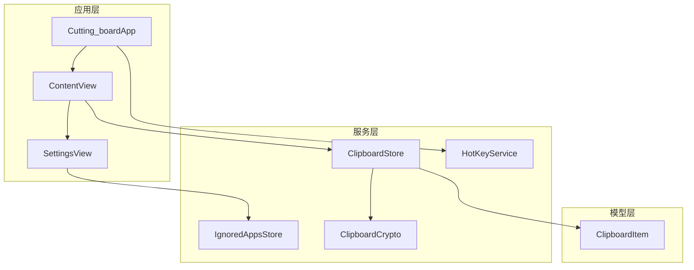
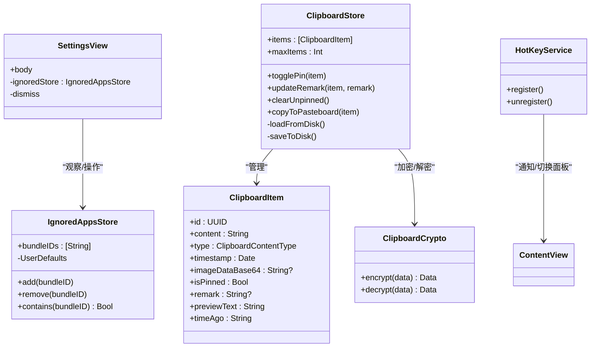
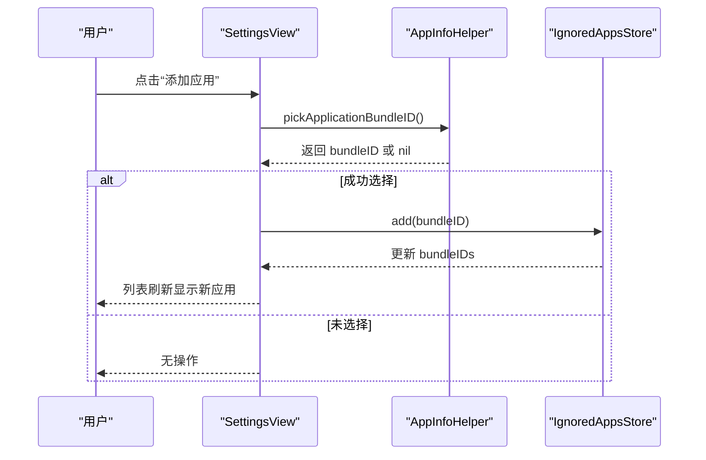
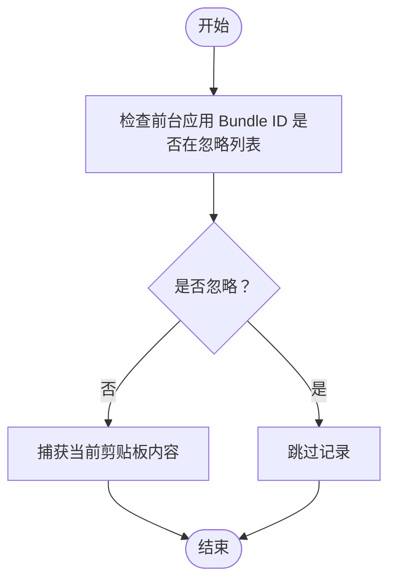
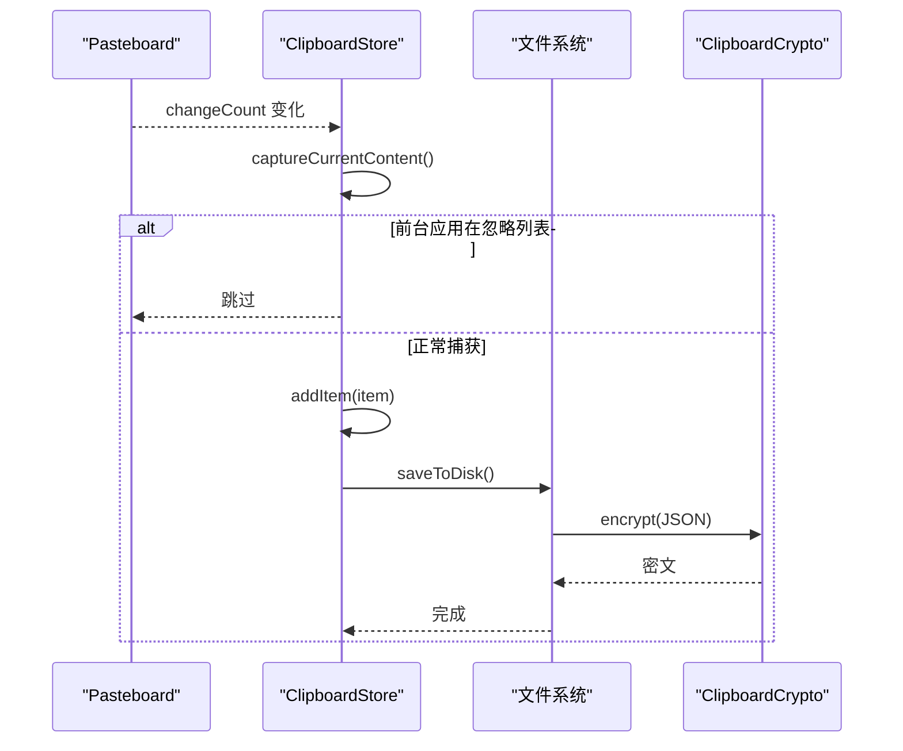
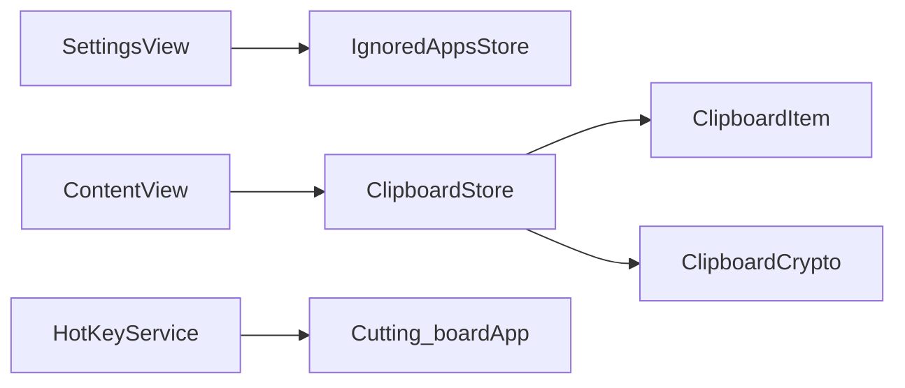

# 设置界面

<cite>
**本文引用的文件**
- [SettingsView.swift](file://Cutting_board/SettingsView.swift)
- [IgnoredAppsStore.swift](file://Cutting_board/Services/IgnoredAppsStore.swift)
- [ClipboardStore.swift](file://Cutting_board/Services/ClipboardStore.swift)
- [ClipboardItem.swift](file://Cutting_board/Models/ClipboardItem.swift)
- [Cutting_boardApp.swift](file://Cutting_board/Cutting_boardApp.swift)
- [ContentView.swift](file://Cutting_board/ContentView.swift)
- [HotKeyService.swift](file://Cutting_board/Services/HotKeyService.swift)
- [ClipboardCrypto.swift](file://Cutting_board/Services/ClipboardCrypto.swift)
</cite>

## 目录
1. [简介](#简介)
2. [项目结构](#项目结构)
3. [核心组件](#核心组件)
4. [架构总览](#架构总览)
5. [详细组件分析](#详细组件分析)
6. [依赖关系分析](#依赖关系分析)
7. [性能考量](#性能考量)
8. [故障排查指南](#故障排查指南)
9. [结论](#结论)
10. [附录](#附录)

## 简介
本文件面向“设置界面”的完整技术文档，围绕 SettingsView 的设计理念、实现方式与交互体验展开，重点覆盖：
- 设置项的分类组织与界面布局
- 应用忽略列表管理功能的实现与交互
- 历史记录最大数量配置的现状与扩展建议
- 主题设置选项的现状与扩展建议
- 表单验证、即时反馈与设置同步机制
- 设置数据的持久化存储与恢复
- 可访问性与国际化支持现状与改进建议

## 项目结构
设置界面位于应用的主模块中，采用 SwiftUI 架构，通过服务层与模型层协同工作，实现剪贴板历史管理与设置功能。

图表来源
- [Cutting_boardApp.swift](file://Cutting_board/Cutting_boardApp.swift#L11-L31)
- [ContentView.swift](file://Cutting_board/ContentView.swift#L20-L95)
- [SettingsView.swift](file://Cutting_board/SettingsView.swift#L11-L39)
- [IgnoredAppsStore.swift](file://Cutting_board/Services/IgnoredAppsStore.swift#L16-L40)
- [ClipboardStore.swift](file://Cutting_board/Services/ClipboardStore.swift#L14-L39)
- [ClipboardItem.swift](file://Cutting_board/Models/ClipboardItem.swift#L17-L45)
- [HotKeyService.swift](file://Cutting_board/Services/HotKeyService.swift#L30-L81)
- [ClipboardCrypto.swift](file://Cutting_board/Services/ClipboardCrypto.swift#L16-L46)

章节来源
- [Cutting_boardApp.swift](file://Cutting_board/Cutting_boardApp.swift#L11-L31)
- [ContentView.swift](file://Cutting_board/ContentView.swift#L20-L95)
- [SettingsView.swift](file://Cutting_board/SettingsView.swift#L11-L39)

## 核心组件
- SettingsView：设置页面主体，负责展示与管理“忽略应用程序”列表，并提供完成按钮与最小尺寸约束。
- IgnoredAppsStore：忽略应用列表的单例存储，基于 UserDefaults 持久化，提供添加、移除与查询能力。
- ClipboardStore：剪贴板历史的核心服务，负责监控系统剪贴板变化、去重、排序、修剪与持久化。
- ClipboardItem：剪贴板历史条目的数据模型，包含内容、类型、时间戳、图片 Base64 数据、钉住状态与备注。
- HotKeyService：全局快捷键注册与回调，用于唤起/切换剪贴板面板。
- ClipboardCrypto：历史文件加密/解密服务，使用 AES-GCM 与 Keychain 密钥。

章节来源
- [SettingsView.swift](file://Cutting_board/SettingsView.swift#L11-L88)
- [IgnoredAppsStore.swift](file://Cutting_board/Services/IgnoredAppsStore.swift#L16-L40)
- [ClipboardStore.swift](file://Cutting_board/Services/ClipboardStore.swift#L14-L39)
- [ClipboardItem.swift](file://Cutting_board/Models/ClipboardItem.swift#L17-L45)
- [HotKeyService.swift](file://Cutting_board/Services/HotKeyService.swift#L30-L81)
- [ClipboardCrypto.swift](file://Cutting_board/Services/ClipboardCrypto.swift#L16-L46)

## 架构总览
设置界面采用“视图-服务-模型”分层架构：
- 视图层：SettingsView 与 ContentView 分别承担设置页与主面板的 UI。
- 服务层：IgnoredAppsStore、ClipboardStore、HotKeyService、ClipboardCrypto 提供业务与数据能力。
- 模型层：ClipboardItem 定义历史数据结构。

图表来源
- [SettingsView.swift](file://Cutting_board/SettingsView.swift#L11-L88)
- [IgnoredAppsStore.swift](file://Cutting_board/Services/IgnoredAppsStore.swift#L16-L40)
- [ClipboardStore.swift](file://Cutting_board/Services/ClipboardStore.swift#L14-L39)
- [ClipboardItem.swift](file://Cutting_board/Models/ClipboardItem.swift#L17-L45)
- [HotKeyService.swift](file://Cutting_board/Services/HotKeyService.swift#L30-L81)
- [ClipboardCrypto.swift](file://Cutting_board/Services/ClipboardCrypto.swift#L16-L46)

## 详细组件分析

### SettingsView 组件分析
- 设计理念
  - 采用“标题 + 完成按钮 + 分割线 + 滚动区域”的信息架构，突出设置标题与完成入口。
  - 使用玻璃效果与圆角矩形提升视觉层次，保证在不同背景下的可读性。
  - 通过最小宽高约束确保在不同屏幕尺寸下的一致体验。
- 界面布局
  - 顶部标题与完成按钮采用 HStack，右侧放置完成按钮，支持默认快捷键触发。
  - 中部分割线分隔标题与内容区。
  - 内容区为垂直 VStack，包含“忽略应用程序”分组。
- 交互设计
  - 忽略应用列表使用 ForEach 遍历，每项展示应用图标、名称与“移除”按钮。
  - “添加应用”按钮通过 AppInfoHelper 打开系统选择器，选择后添加至忽略列表。
  - 移除按钮采用纯色按钮样式，避免多余装饰，保持简洁。
- 数据绑定与状态
  - 通过 @ObservedObject 订阅 IgnoredAppsStore 的 bundleIDs 变化，实现列表自动刷新。
  - 通过 Environment 的 dismiss 控制设置页关闭。
- 可访问性
  - 标题与按钮均提供可访问性标签，便于 VoiceOver 识别。
  - 图标使用 accessibilityHidden 标记，避免重复朗读。
- 国际化
  - 当前文本为中文硬编码，建议迁移到本地化资源以支持多语言。

图表来源
- [SettingsView.swift](file://Cutting_board/SettingsView.swift#L78-L86)
- [IgnoredAppsStore.swift](file://Cutting_board/Services/IgnoredAppsStore.swift#L27-L30)
- [IgnoredAppsStore.swift](file://Cutting_board/Services/IgnoredAppsStore.swift#L58-L67)

章节来源
- [SettingsView.swift](file://Cutting_board/SettingsView.swift#L11-L88)

### IgnoredAppsStore 组件分析
- 数据结构
  - bundleIDs：字符串数组，存储被忽略的应用 Bundle ID。
  - 使用 UserDefaults 进行持久化，默认键为固定字符串。
- 关键方法
  - add：去重校验后追加；remove：移除指定 ID；contains：判断是否在忽略列表。
  - @Published 属性在 bundleIDs 修改时自动写入 UserDefaults。
- 与剪贴板监控的关系
  - ClipboardStore 在捕获剪贴板内容时，会检查前台应用的 Bundle ID 是否在忽略列表中，若命中则跳过记录。
- 可扩展点
  - 支持批量导入/导出忽略列表。
  - 支持按应用名称或路径进行模糊匹配与提示。

图表来源
- [ClipboardStore.swift](file://Cutting_board/Services/ClipboardStore.swift#L62-L69)
- [ClipboardStore.swift](file://Cutting_board/Services/ClipboardStore.swift#L65-L90)
- [IgnoredAppsStore.swift](file://Cutting_board/Services/IgnoredAppsStore.swift#L36-L39)

章节来源
- [IgnoredAppsStore.swift](file://Cutting_board/Services/IgnoredAppsStore.swift#L16-L40)
- [ClipboardStore.swift](file://Cutting_board/Services/ClipboardStore.swift#L62-L69)

### ClipboardStore 组件分析
- 历史管理
  - items：历史记录数组，按“钉住项优先、时间倒序”排列。
  - maxItems：最大历史数量，修改后触发 trimIfNeeded 自动修剪。
  - trimIfNeeded：保留所有钉住项，按剩余容量裁剪未钉住项。
- 剪贴板监控
  - 使用定时器轮询 NSPasteboard 的 changeCount，检测变化后捕获内容。
  - 优先尝试图片 Base64 化，其次处理纯文本。
  - 去重策略：与首项内容与类型一致（图片需 Base64 也一致）则忽略。
- 持久化
  - loadFromDisk：异步读取磁盘文件，尝试解密，解析 JSON 后排序与修剪。
  - saveToDisk：异步写入磁盘，先编码再加密。
- 备注与钉住
  - updateRemark：更新备注并持久化。
  - togglePin：切换钉住状态并重新排序。
- 复制到系统剪贴板
  - copyToPasteboard：根据类型写回文本或图片对象。

图表来源
- [ClipboardStore.swift](file://Cutting_board/Services/ClipboardStore.swift#L47-L60)
- [ClipboardStore.swift](file://Cutting_board/Services/ClipboardStore.swift#L65-L90)
- [ClipboardStore.swift](file://Cutting_board/Services/ClipboardStore.swift#L210-L221)
- [ClipboardCrypto.swift](file://Cutting_board/Services/ClipboardCrypto.swift#L32-L46)

章节来源
- [ClipboardStore.swift](file://Cutting_board/Services/ClipboardStore.swift#L14-L39)
- [ClipboardStore.swift](file://Cutting_board/Services/ClipboardStore.swift#L110-L115)
- [ClipboardStore.swift](file://Cutting_board/Services/ClipboardStore.swift#L183-L221)
- [ClipboardItem.swift](file://Cutting_board/Models/ClipboardItem.swift#L17-L45)

### ClipboardItem 组件分析
- 结构字段
  - id、content、type、timestamp、imageDataBase64、isPinned、remark。
- 编解码
  - 实现 Codable，支持 JSON 序列化与反序列化。
- 辅助属性
  - previewText：预览文本，截断并补充省略号。
  - timeAgo：相对时间，使用本地化格式化器。

章节来源
- [ClipboardItem.swift](file://Cutting_board/Models/ClipboardItem.swift#L17-L45)
- [ClipboardItem.swift](file://Cutting_board/Models/ClipboardItem.swift#L74-L88)

### 主题设置与历史数量配置现状
- 主题设置
  - 当前未在设置界面暴露主题选项；可通过系统外观或应用内颜色方案控制。
- 历史数量配置
  - maxItems 为可变属性，但未在设置界面提供 UI 控件；建议新增 Slider/Stepper 并绑定到 maxItems。
- 建议实现要点
  - 使用 @AppStorage 或 UserDefaults 持久化用户偏好。
  - 提供即时反馈（如滑块拖动时的数值提示）。
  - 同步机制：修改后立即调用 trimIfNeeded 并保存。

章节来源
- [ClipboardStore.swift](file://Cutting_board/Services/ClipboardStore.swift#L20-L23)
- [ClipboardStore.swift](file://Cutting_board/Services/ClipboardStore.swift#L110-L115)

### 可访问性与国际化支持现状
- 可访问性
  - SettingsView：标题与按钮提供 accessibilityLabel；图标使用 accessibilityHidden。
  - ContentView：大量使用 accessibilityLabel/AccessibilityHint，覆盖搜索、清空、备注、钉住等操作。
- 国际化
  - SettingsView 与部分文本为中文硬编码；建议迁移至 LocalizedStringKey 或 .string(localized:)。
  - 时间格式化使用 zh_CN Locale，建议通过系统语言动态调整。

章节来源
- [SettingsView.swift](file://Cutting_board/SettingsView.swift#L18-L24)
- [SettingsView.swift](file://Cutting_board/SettingsView.swift#L43-L47)
- [ContentView.swift](file://Cutting_board/ContentView.swift#L108-L112)
- [ContentView.swift](file://Cutting_board/ContentView.swift#L144-L147)
- [ClipboardItem.swift](file://Cutting_board/Models/ClipboardItem.swift#L83-L88)

## 依赖关系分析
- SettingsView 依赖 IgnoredAppsStore 提供忽略列表数据与操作。
- ClipboardStore 依赖 ClipboardItem 作为数据模型，并通过 ClipboardCrypto 进行文件加密。
- HotKeyService 通过通知中心与 AppDelegate 协作，实现全局快捷键唤起面板。
- ContentView 与 SettingsView 通过 Sheet 与环境变量协作，实现设置页弹出与关闭。

图表来源
- [SettingsView.swift](file://Cutting_board/SettingsView.swift#L12-L13)
- [IgnoredAppsStore.swift](file://Cutting_board/Services/IgnoredAppsStore.swift#L16-L21)
- [ClipboardStore.swift](file://Cutting_board/Services/ClipboardStore.swift#L14-L19)
- [ClipboardItem.swift](file://Cutting_board/Models/ClipboardItem.swift#L17-L45)
- [ClipboardCrypto.swift](file://Cutting_board/Services/ClipboardCrypto.swift#L16-L46)
- [HotKeyService.swift](file://Cutting_board/Services/HotKeyService.swift#L30-L81)
- [Cutting_boardApp.swift](file://Cutting_board/Cutting_boardApp.swift#L35-L143)

章节来源
- [SettingsView.swift](file://Cutting_board/SettingsView.swift#L11-L39)
- [IgnoredAppsStore.swift](file://Cutting_board/Services/IgnoredAppsStore.swift#L16-L40)
- [ClipboardStore.swift](file://Cutting_board/Services/ClipboardStore.swift#L14-L39)
- [ClipboardItem.swift](file://Cutting_board/Models/ClipboardItem.swift#L17-L45)
- [HotKeyService.swift](file://Cutting_board/Services/HotKeyService.swift#L30-L81)
- [Cutting_boardApp.swift](file://Cutting_board/Cutting_boardApp.swift#L35-L143)

## 性能考量
- 视图渲染
  - SettingsView 使用 ForEach 遍历忽略列表，建议确保 bundleIDs 稳定且数量可控，避免频繁重建。
  - ContentView 的列表使用 LazyVStack 与 equatable 优化，减少不必要的重绘。
- 数据持久化
  - ClipboardStore 的 loadFromDisk/saveToDisk 在后台队列执行，避免阻塞主线程。
  - 历史文件加密/解密在写入前完成，读取时尝试解密兼容旧版本明文。
- 监控与去重
  - 定时器周期为 0.5 秒，折中考虑响应速度与 CPU 占用；可根据需要调整。
  - 去重逻辑在主线程异步更新，确保 UI 即时反映。

章节来源
- [SettingsView.swift](file://Cutting_board/SettingsView.swift#L49-L75)
- [ContentView.swift](file://Cutting_board/ContentView.swift#L184-L207)
- [ClipboardStore.swift](file://Cutting_board/Services/ClipboardStore.swift#L47-L53)
- [ClipboardStore.swift](file://Cutting_board/Services/ClipboardStore.swift#L94-L108)
- [ClipboardStore.swift](file://Cutting_board/Services/ClipboardStore.swift#L183-L221)

## 故障排查指南
- 忽略应用无效
  - 检查前台应用 Bundle ID 是否正确；确认 IgnoredAppsStore 的 contains 返回值。
  - 确认 ClipboardStore 在捕获时读取了正确的忽略键。
- 历史数量未生效
  - 确认 maxItems 修改后调用了 trimIfNeeded；检查保存流程是否成功。
- 设置页无法关闭
  - 确认 Environment 的 dismiss 是否正确注入；检查完成按钮的键盘快捷键绑定。
- 可访问性问题
  - 确保按钮与输入框都有 accessibilityLabel；图标使用 accessibilityHidden 标记。
- 国际化显示异常
  - 检查本地化键值是否存在；确认时间格式化使用的 Locale 是否正确。

章节来源
- [IgnoredAppsStore.swift](file://Cutting_board/Services/IgnoredAppsStore.swift#L36-L39)
- [ClipboardStore.swift](file://Cutting_board/Services/ClipboardStore.swift#L110-L115)
- [SettingsView.swift](file://Cutting_board/SettingsView.swift#L22-L24)
- [ContentView.swift](file://Cutting_board/ContentView.swift#L108-L112)
- [ClipboardItem.swift](file://Cutting_board/Models/ClipboardItem.swift#L83-L88)

## 结论
设置界面以简洁直观的方式实现了“忽略应用程序”管理，配合剪贴板历史服务形成完整的使用闭环。当前设置项较为集中于忽略列表，建议后续扩展主题设置与历史数量配置，并完善表单验证、即时反馈与设置同步机制。同时，应加强国际化与可访问性支持，提升多语言与无障碍体验。

## 附录
- 术语
  - Bundle ID：应用的唯一标识符，用于区分不同应用。
  - Base64：二进制数据的文本表示，常用于图片存储。
  - AES-GCM：对称加密算法，提供机密性与完整性保护。
- 建议的设置项扩展
  - 主题设置：浅色/深色/跟随系统；可结合系统外观或应用内颜色方案。
  - 历史数量：Slider/Stepper 控件，范围 50–500；实时预览当前占用空间。
  - 自动清理：启用/禁用自动清理未钉住项；可设置保留天数。
  - 通知与快捷键：全局快捷键自定义；复制后通知开关。
  - 备注搜索：增强备注搜索与高亮显示。