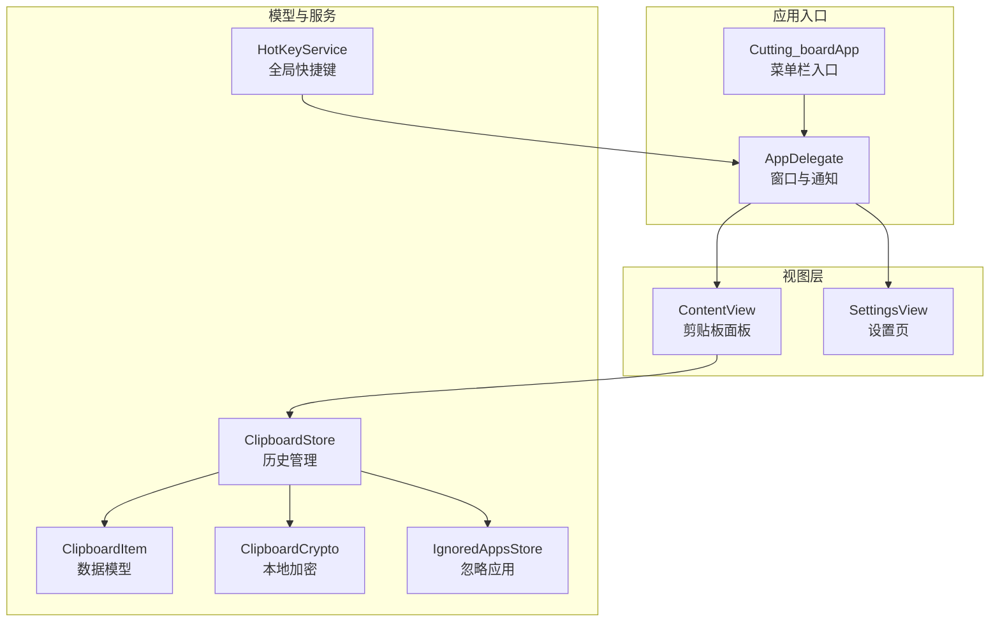

# 项目概述

<cite>
**本文档引用的文件**
- [Cutting_boardApp.swift](file://Cutting_board/Cutting_boardApp.swift)
- [ContentView.swift](file://Cutting_board/ContentView.swift)
- [SettingsView.swift](file://Cutting_board/SettingsView.swift)
- [ClipboardItem.swift](file://Cutting_board/Models/ClipboardItem.swift)
- [ClipboardStore.swift](file://Cutting_board/Services/ClipboardStore.swift)
- [HotKeyService.swift](file://Cutting_board/Services/HotKeyService.swift)
- [ClipboardCrypto.swift](file://Cutting_board/Services/ClipboardCrypto.swift)
- [IgnoredAppsStore.swift](file://Cutting_board/Services/IgnoredAppsStore.swift)
- [build-and-package.sh](file://build-and-package.sh)
</cite>

## 目录
1. [简介](#简介)
2. [项目结构](#项目结构)
3. [核心组件](#核心组件)
4. [架构总览](#架构总览)
5. [详细组件分析](#详细组件分析)
6. [依赖关系分析](#依赖关系分析)
7. [性能考虑](#性能考虑)
8. [故障排除指南](#故障排除指南)
9. [结论](#结论)
10. [附录](#附录)

## 简介
Cutting_board 是一个基于 Swift 和 SwiftUI 的 macOS 桌面应用程序，专注于提供高效、安全、易用的剪贴板历史管理体验。它通过菜单栏入口快速唤起剪贴板面板，支持文本与图片的历史记录查看、搜索、备注、置顶与一键粘贴，并内置全局快捷键、应用忽略策略与本地加密存储，帮助用户在日常开发与办公场景中更便捷地复用历史内容。

- 核心价值
  - 提升效率：一键唤起、快速检索、双击粘贴，减少重复复制粘贴操作。
  - 增强可控性：支持备注、置顶、忽略特定应用等功能，满足个性化工作流。
  - 安全可靠：本地历史文件采用加密存储，避免敏感信息泄露。
  - 低侵入：菜单栏常驻，无需额外窗口占用，适合后台持续使用。

- 目标用户
  - 开发者与设计师：频繁在不同应用间切换、需要快速复用代码片段、设计资源等。
  - 内容创作者：需要整理与重用文案、图片素材。
  - 办公人员：处理大量文本与图片，追求高效与整洁的工作流。

- 与其他剪贴板工具的区别
  - 全局快捷键无需辅助功能权限即可使用，降低授权门槛。
  - 本地加密存储，保障隐私；支持忽略特定应用，避免无关内容污染历史。
  - SwiftUI 实现的现代界面与交互，提供流畅的玻璃材质视觉与无障碍体验。

## 项目结构
项目采用“模型-服务-视图”分层组织，核心文件分布如下：
- 应用入口与生命周期：Cutting_boardApp.swift、AppDelegate
- 视图层：ContentView.swift（主面板）、SettingsView.swift（设置页）
- 数据模型：Models/ClipboardItem.swift
- 业务服务：Services/ClipboardStore.swift（历史管理）、HotKeyService.swift（全局快捷键）、ClipboardCrypto.swift（加密）、IgnoredAppsStore.swift（忽略应用）
- 构建与打包：build-and-package.sh

**图表来源**
- [Cutting_boardApp.swift](file://Cutting_board/Cutting_boardApp.swift#L11-L31)
- [ContentView.swift](file://Cutting_board/ContentView.swift#L20-L95)
- [SettingsView.swift](file://Cutting_board/SettingsView.swift#L11-L39)
- [ClipboardItem.swift](file://Cutting_board/Models/ClipboardItem.swift#L16-L45)
- [ClipboardStore.swift](file://Cutting_board/Services/ClipboardStore.swift#L14-L39)
- [HotKeyService.swift](file://Cutting_board/Services/HotKeyService.swift#L30-L69)
- [ClipboardCrypto.swift](file://Cutting_board/Services/ClipboardCrypto.swift#L16-L30)
- [IgnoredAppsStore.swift](file://Cutting_board/Services/IgnoredAppsStore.swift#L16-L25)

**章节来源**
- [Cutting_boardApp.swift](file://Cutting_board/Cutting_boardApp.swift#L11-L31)
- [ContentView.swift](file://Cutting_board/ContentView.swift#L20-L95)
- [SettingsView.swift](file://Cutting_board/SettingsView.swift#L11-L39)
- [ClipboardItem.swift](file://Cutting_board/Models/ClipboardItem.swift#L16-L45)
- [ClipboardStore.swift](file://Cutting_board/Services/ClipboardStore.swift#L14-L39)
- [HotKeyService.swift](file://Cutting_board/Services/HotKeyService.swift#L30-L69)
- [ClipboardCrypto.swift](file://Cutting_board/Services/ClipboardCrypto.swift#L16-L30)
- [IgnoredAppsStore.swift](file://Cutting_board/Services/IgnoredAppsStore.swift#L16-L25)

## 核心组件
- 应用入口与生命周期
  - Cutting_boardApp：定义菜单栏入口，提供“打开/关闭剪贴板”和“退出”按钮，并绑定全局快捷键。
  - AppDelegate：负责创建剪贴板面板窗口、注册全局快捷键、监听显示/隐藏/切换通知、处理应用终止与窗口关闭策略。

- 视图层
  - ContentView：主面板，包含头部、搜索框、列表与空态/无结果提示；支持键盘导航、双击粘贴、备注编辑、置顶与清空未钉住项。
  - SettingsView：设置页，展示忽略的应用列表，支持添加/移除与应用信息展示。

- 数据模型与服务
  - ClipboardItem：剪贴板历史条目，包含内容、类型、时间戳、图片Base64、置顶状态与备注。
  - ClipboardStore：历史存储与监控，负责定时轮询系统剪贴板、去重、排序、持久化、加密读写与清空逻辑。
  - HotKeyService：使用 Carbon API 注册全局快捷键，无需辅助功能权限。
  - ClipboardCrypto：基于 Keychain 的密钥生成与 AES-GCM 加密，确保历史文件安全。
  - IgnoredAppsStore：维护忽略的应用Bundle ID列表，支持从系统选择应用并读取图标与名称。

**章节来源**
- [Cutting_boardApp.swift](file://Cutting_board/Cutting_boardApp.swift#L11-L31)
- [Cutting_boardApp.swift](file://Cutting_board/Cutting_boardApp.swift#L35-L143)
- [ContentView.swift](file://Cutting_board/ContentView.swift#L20-L95)
- [SettingsView.swift](file://Cutting_board/SettingsView.swift#L11-L39)
- [ClipboardItem.swift](file://Cutting_board/Models/ClipboardItem.swift#L16-L45)
- [ClipboardStore.swift](file://Cutting_board/Services/ClipboardStore.swift#L14-L39)
- [HotKeyService.swift](file://Cutting_board/Services/HotKeyService.swift#L30-L69)
- [ClipboardCrypto.swift](file://Cutting_board/Services/ClipboardCrypto.swift#L16-L30)
- [IgnoredAppsStore.swift](file://Cutting_board/Services/IgnoredAppsStore.swift#L16-L25)

## 架构总览
系统采用“菜单栏入口 + 自托管面板窗口 + SwiftUI 视图”的架构，配合 AppKit 的 NSPasteboard 实现剪贴板监控，结合本地加密与忽略应用策略，形成完整的剪贴板历史管理闭环。

**图表来源**
- [Cutting_boardApp.swift](file://Cutting_board/Cutting_boardApp.swift#L15-L30)
- [Cutting_boardApp.swift](file://Cutting_board/Cutting_boardApp.swift#L46-L76)
- [HotKeyService.swift](file://Cutting_board/Services/HotKeyService.swift#L30-L69)
- [ClipboardStore.swift](file://Cutting_board/Services/ClipboardStore.swift#L47-L90)
- [ClipboardStore.swift](file://Cutting_board/Services/ClipboardStore.swift#L183-L221)
- [ClipboardCrypto.swift](file://Cutting_board/Services/ClipboardCrypto.swift#L32-L46)
- [IgnoredAppsStore.swift](file://Cutting_board/Services/IgnoredAppsStore.swift#L23-L40)

## 详细组件分析

### 组件A：剪贴板监控与历史管理（ClipboardStore）
- 职责
  - 定时轮询系统剪贴板变更，捕获文本与图片内容，去重后插入历史队列。
  - 支持置顶、备注、清空未钉住项、整体清空等操作。
  - 本地持久化，采用异步队列进行读写，JSON 编解码并结合加密存储。
- 关键流程
  - 初始化：定位 Application Support 目录，加载历史，启动定时器。
  - 监控：每 0.5 秒检查 changeCount，若变化则捕获当前内容。
  - 捕获：优先图片（PNG Base64），其次文本；忽略来自忽略应用的内容。
  - 去重：相同内容与图片数据不重复插入。
  - 排序：置顶项优先，其余按时间倒序。
  - 持久化：异步写入，加密存储，保证线程安全。

**图表来源**
- [ClipboardStore.swift](file://Cutting_board/Services/ClipboardStore.swift#L47-L90)
- [ClipboardStore.swift](file://Cutting_board/Services/ClipboardStore.swift#L94-L108)
- [ClipboardStore.swift](file://Cutting_board/Services/ClipboardStore.swift#L142-L147)
- [ClipboardStore.swift](file://Cutting_board/Services/ClipboardStore.swift#L210-L221)
- [ClipboardCrypto.swift](file://Cutting_board/Services/ClipboardCrypto.swift#L32-L36)

**章节来源**
- [ClipboardStore.swift](file://Cutting_board/Services/ClipboardStore.swift#L14-L39)
- [ClipboardStore.swift](file://Cutting_board/Services/ClipboardStore.swift#L47-L90)
- [ClipboardStore.swift](file://Cutting_board/Services/ClipboardStore.swift#L94-L108)
- [ClipboardStore.swift](file://Cutting_board/Services/ClipboardStore.swift#L110-L147)
- [ClipboardStore.swift](file://Cutting_board/Services/ClipboardStore.swift#L150-L179)
- [ClipboardStore.swift](file://Cutting_board/Services/ClipboardStore.swift#L183-L221)

### 组件B：全局快捷键（HotKeyService）
- 职责
  - 使用 Carbon API 注册全局快捷键 Command+P，在任意应用焦点下均可触发。
  - 通过通知中心广播显示/隐藏/切换面板事件，供 AppDelegate 处理。
- 关键点
  - 事件处理器安装与热键注册，失败时清理资源。
  - 回调中通过主线程发布通知，确保 UI 响应一致性。

**图表来源**
- [HotKeyService.swift](file://Cutting_board/Services/HotKeyService.swift#L22-L27)
- [HotKeyService.swift](file://Cutting_board/Services/HotKeyService.swift#L36-L69)
- [Cutting_boardApp.swift](file://Cutting_board/Cutting_boardApp.swift#L123-L133)

**章节来源**
- [HotKeyService.swift](file://Cutting_board/Services/HotKeyService.swift#L12-L16)
- [HotKeyService.swift](file://Cutting_board/Services/HotKeyService.swift#L22-L27)
- [HotKeyService.swift](file://Cutting_board/Services/HotKeyService.swift#L36-L69)
- [Cutting_boardApp.swift](file://Cutting_board/Cutting_boardApp.swift#L123-L133)

### 组件C：本地加密存储（ClipboardCrypto）
- 职责
  - 生成/加载对称密钥（32 字节），使用 AES-GCM 进行加密与解密。
  - 密文格式包含固定魔数头，兼容旧版明文历史文件。
  - 密钥存储于 Keychain，避免明文落盘。
- 关键流程
  - 加密：生成 sealedBox，拼接魔数头输出。
  - 解密：判断魔数头，若是加密则解密，否则返回原文。

**图表来源**
- [ClipboardCrypto.swift](file://Cutting_board/Services/ClipboardCrypto.swift#L32-L46)
- [ClipboardCrypto.swift](file://Cutting_board/Services/ClipboardCrypto.swift#L48-L60)

**章节来源**
- [ClipboardCrypto.swift](file://Cutting_board/Services/ClipboardCrypto.swift#L16-L30)
- [ClipboardCrypto.swift](file://Cutting_board/Services/ClipboardCrypto.swift#L32-L46)
- [ClipboardCrypto.swift](file://Cutting_board/Services/ClipboardCrypto.swift#L48-L60)

### 组件D：应用忽略策略（IgnoredAppsStore + AppInfoHelper）
- 职责
  - 维护忽略的应用 Bundle ID 列表，支持添加/移除与查询。
  - 提供应用图标与名称读取，支持通过 NSOpenPanel 选择应用。
- 交互
  - SettingsView 展示忽略列表，支持点击移除与添加新应用。

**章节来源**
- [IgnoredAppsStore.swift](file://Cutting_board/Services/IgnoredAppsStore.swift#L16-L40)
- [IgnoredAppsStore.swift](file://Cutting_board/Services/IgnoredAppsStore.swift#L44-L68)
- [SettingsView.swift](file://Cutting_board/SettingsView.swift#L41-L88)

### 组件E：视图层（ContentView 与 SettingsView）
- ContentView
  - 结构：头部（标题、计数、设置按钮）、搜索框、列表/空态/无结果过渡。
  - 行视图：左侧缩略图/类型图标，中间内容预览与备注行，右侧备注与置顶按钮。
  - 交互：键盘上下移动选中、回车粘贴、Esc 关闭、右键菜单、双击粘贴。
  - 可访问性：为每个元素提供标签与提示，支持减少动态效果。
- SettingsView
  - 展示忽略应用列表，支持添加/移除，显示应用图标与名称。

**章节来源**
- [ContentView.swift](file://Cutting_board/ContentView.swift#L20-L95)
- [ContentView.swift](file://Cutting_board/ContentView.swift#L184-L207)
- [ContentView.swift](file://Cutting_board/ContentView.swift#L321-L471)
- [SettingsView.swift](file://Cutting_board/SettingsView.swift#L11-L39)
- [SettingsView.swift](file://Cutting_board/SettingsView.swift#L41-L88)

## 依赖关系分析
- 组件耦合
  - ContentView 依赖 ClipboardStore（只读 items），通过通知关闭面板。
  - AppDelegate 依赖 HotKeyService 与 ClipboardStore，协调窗口显示与快捷键。
  - ClipboardStore 依赖 ClipboardCrypto 与 IgnoredAppsStore，实现安全与策略控制。
- 外部依赖
  - AppKit：NSPasteboard、NSWindow、NSImage、NSWorkspace 等。
  - SwiftUI：@ObservableObject、@Published、View、Environment 等。
  - Carbon：全局快捷键事件处理。
- 循环依赖
  - 未发现循环依赖，各模块职责清晰，通过通知与共享实例交互。

**图表来源**
- [ContentView.swift](file://Cutting_board/ContentView.swift#L20-L21)
- [Cutting_boardApp.swift](file://Cutting_board/Cutting_boardApp.swift#L35-L44)
- [ClipboardStore.swift](file://Cutting_board/Services/ClipboardStore.swift#L14-L15)
- [HotKeyService.swift](file://Cutting_board/Services/HotKeyService.swift#L30-L34)
- [ClipboardCrypto.swift](file://Cutting_board/Services/ClipboardCrypto.swift#L16-L17)
- [IgnoredAppsStore.swift](file://Cutting_board/Services/IgnoredAppsStore.swift#L16-L17)
- [SettingsView.swift](file://Cutting_board/SettingsView.swift#L11-L12)

**章节来源**
- [ContentView.swift](file://Cutting_board/ContentView.swift#L20-L21)
- [Cutting_boardApp.swift](file://Cutting_board/Cutting_boardApp.swift#L35-L44)
- [ClipboardStore.swift](file://Cutting_board/Services/ClipboardStore.swift#L14-L15)
- [HotKeyService.swift](file://Cutting_board/Services/HotKeyService.swift#L30-L34)
- [ClipboardCrypto.swift](file://Cutting_board/Services/ClipboardCrypto.swift#L16-L17)
- [IgnoredAppsStore.swift](file://Cutting_board/Services/IgnoredAppsStore.swift#L16-L17)
- [SettingsView.swift](file://Cutting_board/SettingsView.swift#L11-L12)

## 性能考虑
- 剪贴板轮询
  - 0.5 秒间隔检查 changeCount，平衡实时性与 CPU 占用。
  - 捕获图片时转换为 PNG Base64，注意内存与 I/O 成本，建议限制最大历史数量。
- 列表渲染
  - 使用 LazyVStack 与 ScrollViewReader，提升大数据量滚动性能。
  - 行视图使用 Equatable 优化重绘，缓存图片缩略图。
- 线程与异步
  - 持久化与加密在专用队列执行，避免阻塞主线程。
  - UI 更新统一回到主线程，保证响应一致性。
- 磁盘 I/O
  - JSON 编码启用排序键与美化输出，兼顾可读性与体积；加密后写入，避免明文泄露风险。

[本节为通用性能建议，不直接分析具体文件]

## 故障排除指南
- 全局快捷键无效
  - 检查是否正确注册热键与事件处理器；确认未被其他应用占用。
  - 参考路径：[HotKeyService.swift](file://Cutting_board/Services/HotKeyService.swift#L36-L69)
- 面板无法显示/隐藏
  - 确认 AppDelegate 已创建面板窗口并注册通知；检查菜单栏入口与快捷键。
  - 参考路径：[Cutting_boardApp.swift](file://Cutting_board/Cutting_boardApp.swift#L78-L98), [Cutting_boardApp.swift](file://Cutting_board/Cutting_boardApp.swift#L123-L133)
- 历史不更新
  - 检查定时器是否启动、changeCount 是否变化；确认未被忽略应用列表拦截。
  - 参考路径：[ClipboardStore.swift](file://Cutting_board/Services/ClipboardStore.swift#L47-L60), [ClipboardStore.swift](file://Cutting_board/Services/ClipboardStore.swift#L66-L69)
- 历史文件损坏或无法读取
  - 检查加密魔数头与 Keychain 密钥；必要时回退到明文兼容逻辑。
  - 参考路径：[ClipboardCrypto.swift](file://Cutting_board/Services/ClipboardCrypto.swift#L38-L46), [ClipboardCrypto.swift](file://Cutting_board/Services/ClipboardCrypto.swift#L48-L60)
- 设置页无法添加忽略应用
  - 确认 NSOpenPanel 返回有效 Bundle ID；检查 UserDefaults 存储。
  - 参考路径：[SettingsView.swift](file://Cutting_board/SettingsView.swift#L78-L82), [IgnoredAppsStore.swift](file://Cutting_board/Services/IgnoredAppsStore.swift#L23-L40)

**章节来源**
- [HotKeyService.swift](file://Cutting_board/Services/HotKeyService.swift#L36-L69)
- [Cutting_boardApp.swift](file://Cutting_board/Cutting_boardApp.swift#L78-L98)
- [Cutting_boardApp.swift](file://Cutting_board/Cutting_boardApp.swift#L123-L133)
- [ClipboardStore.swift](file://Cutting_board/Services/ClipboardStore.swift#L47-L60)
- [ClipboardStore.swift](file://Cutting_board/Services/ClipboardStore.swift#L66-L69)
- [ClipboardCrypto.swift](file://Cutting_board/Services/ClipboardCrypto.swift#L38-L46)
- [ClipboardCrypto.swift](file://Cutting_board/Services/ClipboardCrypto.swift#L48-L60)
- [SettingsView.swift](file://Cutting_board/SettingsView.swift#L78-L82)
- [IgnoredAppsStore.swift](file://Cutting_board/Services/IgnoredAppsStore.swift#L23-L40)

## 结论
Cutting_board 通过简洁而强大的设计，将剪贴板监控、历史管理、安全存储与便捷交互有机结合。其菜单栏入口与全局快捷键降低了使用门槛，本地加密与忽略策略提升了隐私与可控性，SwiftUI 的现代化界面与无障碍能力则确保了良好的用户体验。对于追求效率与隐私的 macOS 用户而言，这是一个值得信赖的剪贴板增强工具。

[本节为总结性内容，不直接分析具体文件]

## 附录
- 构建与打包
  - 使用脚本进行 Release 构建、清除扩展属性、签名与打包，便于分发。
  - 参考路径：[build-and-package.sh](file://build-and-package.sh#L11-L27)

**章节来源**
- [build-and-package.sh](file://build-and-package.sh#L11-L27)