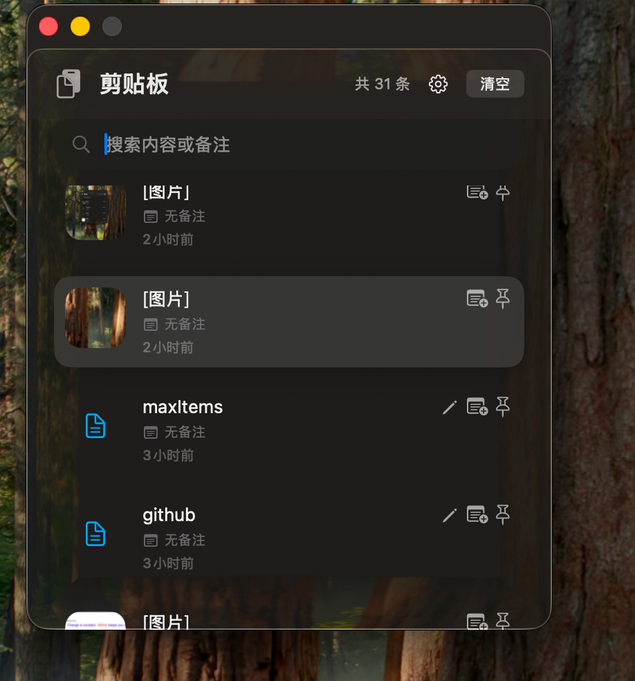
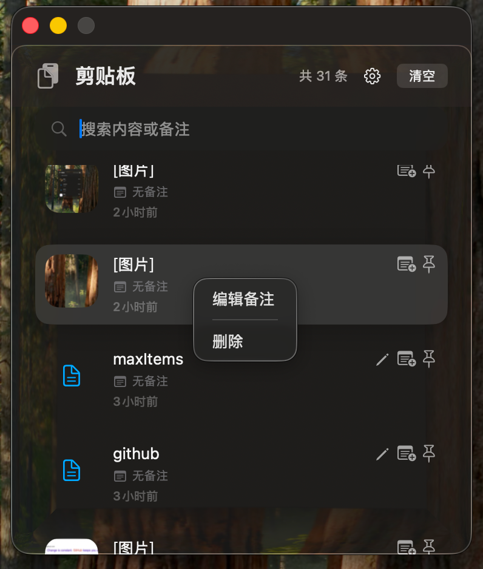
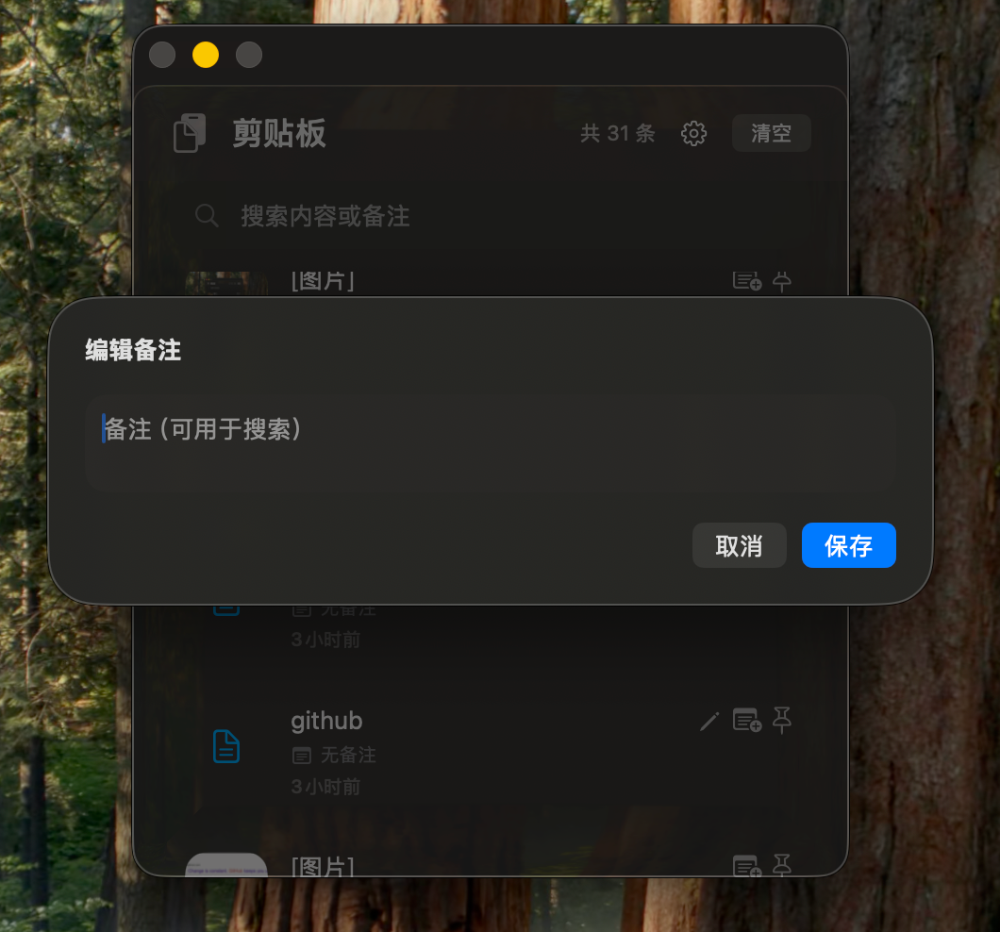
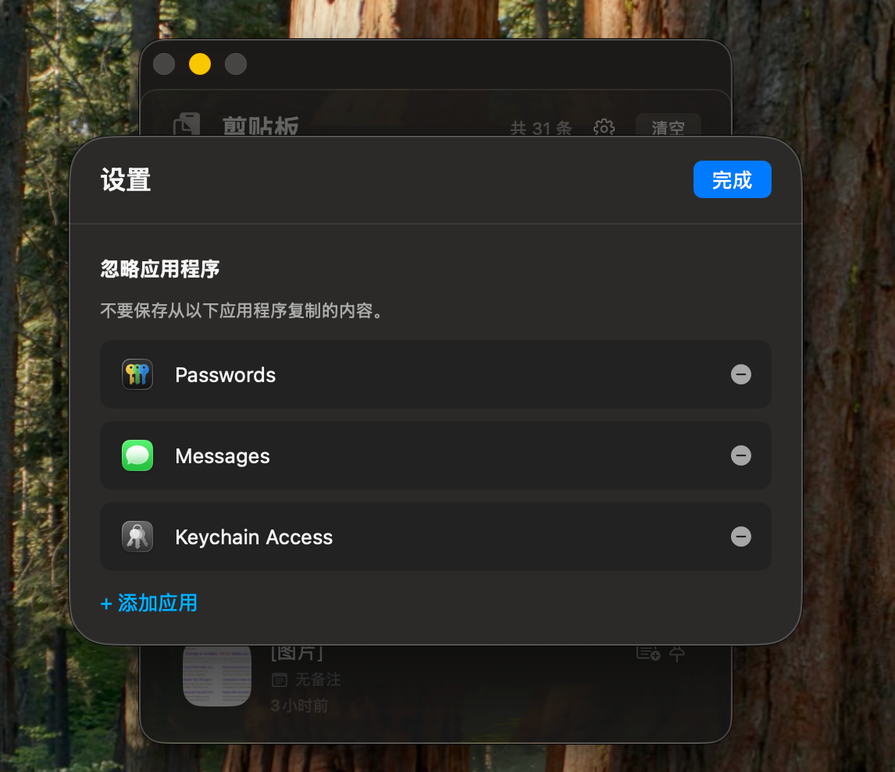

# Cutting_board - 剪贴板增强工具

[](https://developer.apple.com/macos/)
[](https://swift.org)
[](LICENSE)
[](CONTRIBUTING.md)

**Cutting_board** 是一款 macOS 菜单栏剪贴板增强工具，支持全局快捷键、历史管理、加密存储与应用忽略策略。


## ✨ 功能特性

### 🚀 核心功能
- **全局快捷键唤起** - `⌘P` 快速打开剪贴板面板，无需辅助功能权限
- **实时监控** - 自动记录文本和图片复制历史（每 0.5 秒轮询）
- **智能管理** - 支持搜索、备注、置顶（钉住）、清空未置顶项
- **数据安全** - AES-GCM 加密存储，密钥存于 Keychain
- **应用忽略** - 可设置不记录特定应用的复制内容
- **双击粘贴** - 快速将历史记录粘贴到当前应用

### 🎨 界面设计
- **现代 SwiftUI** - 流畅的玻璃材质视觉效果
- **无障碍支持** - 完整的 VoiceOver 标签和提示
- **键盘导航** - 上下箭头选择，回车粘贴，Esc 关闭
- **右键菜单** - 编辑备注、删除条目
- **自适应布局** - 支持动态字体和减少动画选项

## 📸 截图预览

> 💡 提示：请添加应用截图到 `/screenshots/` 目录并在此处展示





## 📦 安装方式

### 方法一：下载预编译版本
1. 从 [Releases](https://github.com/WJIAEN-K/Cutting_board/releases) 下载最新版 `ding-mac.zip`
2. 解压后将 `ding.app` 拖入 `/Applications` 文件夹
3. 在菜单栏点击图标或按 `⌘P` 使用

### 方法二：从源码构建
```bash
# 克隆仓库
git clone https://github.com/WJIAEN-K/Cutting_board.git
cd Cutting_board

# 使用 Xcode 构建
open Cutting_board.xcodeproj

# 或使用命令行构建
./build-and-package.sh
```

## 🚀 快速开始

### 首次使用
1. 运行应用后，菜单栏会出现剪贴板图标
2. 复制任意文本或图片
3. 按 `⌘P` 打开剪贴板面板查看历史
4. 双击条目或按回车键粘贴到当前应用

### 基本操作
| 快捷键 | 功能 |
|--------|------|
| `⌘P` | 打开/关闭剪贴板面板 |
| `↑` / `↓` | 上下移动选中项 |
| `Enter` | 粘贴选中项 |
| `Delete` | 删除选中项 |
| `Esc` | 关闭面板 |
| `⌘Q` | 退出应用 |

### 高级功能
- **添加备注**：右键点击条目 → "编辑备注"，便于搜索
- **置顶条目**：点击图钉图标，置顶后不会被清理
- **忽略应用**：设置页添加不想记录的应用（如密码管理器）
- **清空历史**：点击"清空"按钮，保留已置顶项

## 🏗️ 技术架构

### 系统要求
- **macOS**: 26.1 (Sequoia) 或更高版本
- **Xcode**: 16.0+
- **Swift**: 5.9+

### 核心技术栈
- **SwiftUI + AppKit** - 混合开发，兼顾声明式 UI 与原生能力
- **Carbon API** - 全局热键注册（无需辅助功能权限）
- **CryptoKit** - AES-GCM 加密算法
- **Security Framework** - Keychain 密钥管理
- **Combine** - 响应式数据流

### 项目结构
```
Cutting_board/
├── Models/
│   └── ClipboardItem.swift      # 数据模型
├── Services/
│   ├── ClipboardStore.swift     # 历史存储与监控
│   ├── HotKeyService.swift      # 全局快捷键
│   ├── ClipboardCrypto.swift    # 加密服务
│   └── IgnoredAppsStore.swift   # 忽略应用管理
├── ContentView.swift             # 主界面
├── SettingsView.swift            # 设置页
└── Cutting_boardApp.swift        # 应用入口
```

详细文档请参阅 [.qoder/repowiki/zh/content/](.qoder/repowiki/zh/content/)

## 🔒 隐私与安全

- **完全本地运行** - 所有数据存储在本地，无网络请求
- **端到端加密** - 历史文件使用 AES-GCM 加密，密钥存于 Keychain
- **无追踪** - 不包含任何分析、统计或广告 SDK
- **开源透明** - 代码完全开放，可自行审计

## 🤝 贡献指南

欢迎提交 Issue 和 Pull Request！

### 开发环境搭建
```bash
# 克隆项目
git clone https://github.com/WJIAEN-K/Cutting_board.git
cd Cutting_board

# 打开 Xcode 项目
open Cutting_board.xcodeproj
```

### 提交流程
1. Fork 本仓库
2. 创建特性分支 (`git checkout -b feature/AmazingFeature`)
3. 提交更改 (`git commit -m 'Add some AmazingFeature'`)
4. 推送到分支 (`git push origin feature/AmazingFeature`)
5. 开启 Pull Request

详细规范请参阅 [CONTRIBUTING.md](CONTRIBUTING.md)

## 📝 更新日志

请查看 [CHANGELOG.md](CHANGELOG.md) 了解版本历史。

## 🙏 致谢

感谢以下开源项目和贡献者：
- SwiftUI 社区
- macOS 开发者生态
- 所有提交 Issue 和 PR 的朋友

## 📄 许可证

本项目采用 MIT 许可证 - 查看 [LICENSE](LICENSE) 文件了解详情。

## 📬 联系方式

- **作者**: WJIAEN-K
- **项目地址**: https://github.com/WJIAEN-K/Cutting_board
- **问题反馈**: https://github.com/WJIAEN-K/Cutting_board/issues

---

<div align="center">

**⭐ 如果这个项目对你有帮助，请给一个 Star 支持！** 

Made with ❤️ by WJIAEN

</div>
